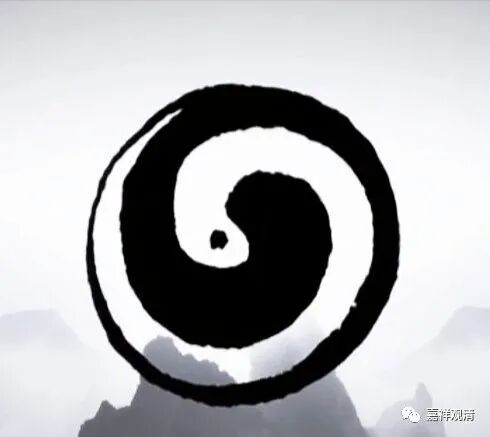
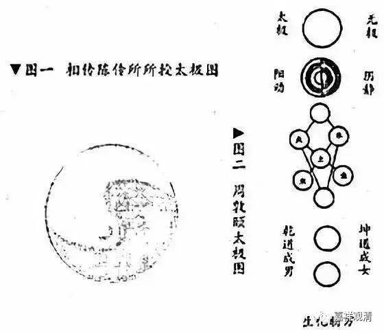
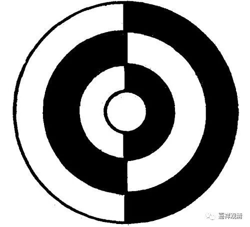
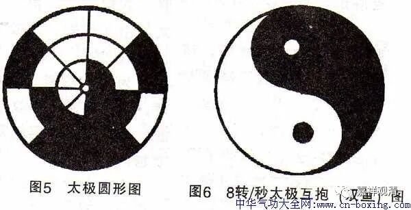
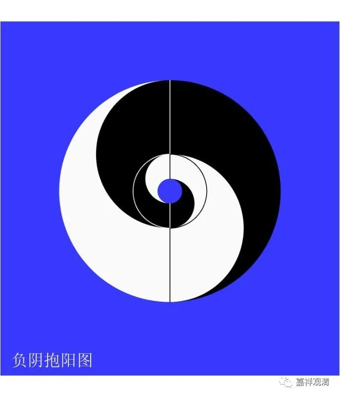

**《微课堂佛教史》246·1**

大家能够想到的是什么？太极图。

太极图这个“圆相”，是什么时候出现的呢？大家通常一听到太极，就认为应该是出现在先秦时代，是吧？但实际上太极图的出现是非常晚的，到北宋周敦颐的时候才开始出现《太极图说》。那么，周敦颐的这个《太极图说》又是从哪里来的呢？一般说是从道家那里来的，说是道家有这样一个太极图。

当然，现在也有其它的说法，我们也不妨先说一下这种说法吧。它的意思就是在西安的附近有两条水——渭水和洛水？具体是哪两条水我不知道，反正这两条河交界的地方，就会出现一条清和浊的界限，所以交汇之处看起来就像太极图一样。就说这个是最早的太极图的来源，这样就把这个来源推到先秦时代去了。

但是我们从文献上来看，好像太极图最早是来源于周敦颐的《太极图说》，是宋代才出现的。那么，宋代才出现的这个太极图，如果再往前的话，是往哪儿推呢？实际上再往前推就是刚才我提到过的麻衣祖师。关于麻衣祖师呢，上海图书馆里面有一本《翠微寺志》，翠微寺就是我以前出家的地方。在这本寺志里面讲，麻衣是一个印度人，他来到汉地后就参禅了，然后就待在黄山这里。这个太极图是麻衣祖师后来传给了陈抟，然后陈抟再传下来的，就和周敦颐有关系。

禅宗的这个圆相呢，我们现在看到的好像太极图，

但是如果仔细去看的话，禅宗里面的图是非常多的，什么水火匡廓图啊等等——

水火匡廓图

就有一堆的图这样一点点地发展出来了。这些图在当时到底是什么意思，我也不知道。现在有一种说法，就是到了后期图形就发生了变化，标准化简单化了。现在的太极图其实和早期的太极图是不一样的，早期的太极图比现在的太极图要复杂一点，它不是一个很简单的S型，而是一个比较复杂的S型。

如果大家去研究一下的话，是可以看到的。

那么，至少在佛教系统当中（比如《翠微寺志》），是认为周敦颐的《太极图说》如果往前推的话，是来自于禅宗的圆相。这个圆相呢，说南阳慧忠国师也好，说仰山慧寂禅师也好，或者就如同《碧岩录》里讲的南泉普愿禅师也好，就是从他们开始，然后慢慢地发展，好像到了曹洞宗，圆相这个图就变得越来越丰富了，以至于就演变出了这种太极图。大家如果有兴趣的话，可以自己去研究一下。

