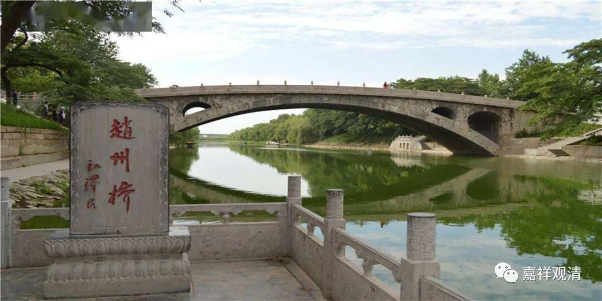

**《微课佛教史》247·2**

赵州从谂禅师，他在赵州应该是晚年的时候，在河北赵州桥附近的观音院。

赵州从谂禅师最著名的一个公案就是“吃茶去”。今天学佛的人当中很多都是喝茶的，还有很多卖茶叶的地方都挂着“禅茶一味”，这个最早就是出自赵州禅师——“吃茶去”，谁来了都是“吃茶去”。明天我也去写一幅“吃茶去”，看看有谁要，哈哈。

 赵州从谂禅师的寿命非常长，一百二十岁。他很早就出家了，好像是九岁，反正是很早就出家了。因为他的年纪很大，最后活到一百二十岁，所以丛林当中就称他为“赵州古佛”，意思是他的年纪非常大。而且丛林当中还有一句话——“赵州八十犹行脚”，就是说他八十岁了还在外面到处走，到处参禅，所以叫“八十犹行脚”。

赵州从谂禅师甚至还说过一句话：“九十年以前，我曾经参访了马祖道一禅师门下的八十多员大善知识。”呵呵，那个就是他很年轻的时候了，说“九十年以前”这句话，至少他是一百岁以后说的吧？所以丛林当中以此来说明什么呢？就是经过一段时间的磨砺之后，是需要出去行脚的，需要出去各处参访。

赵州从谂禅师他活了一百二十岁，“八十犹行脚”。他参访的这些人当中，除了马祖道一禅师门下的那些大善知识以外，甚至还有一些很年轻的、后辈的禅师他也去参访，比如说夹山善会禅师。夹山善会禅师的师父是船子德诚禅师或者叫华亭德诚禅师，华亭德诚禅师的师父是药山惟俨禅师。如果要排辈分的话，好像药山惟俨禅师和赵州从谂禅师是同一辈的。赵州从谂禅师甚至到夹山善会禅师那里去参访，对他来说，夹山善会禅师就完全是个孙子辈的小年轻了。

夹山善会禅师，我不知道将来会不会谈到，关于他的故事我也会稍微提一提的。好像我之前在公众号里面也写到过，夹山善会禅师的师父是船子德诚禅师，很多地方都说船子德诚禅师是跳河死的，这个其实是不成立的。船子德诚禅师所在的华亭是在哪里呢？这个地方就在今天上海金山区的西林寺，实际上是在以前的西林禅寺边上。那条河是很小的，水流也不急，而且又是在上海，这里的河能宽到什么程度呢，是吧？再宽也不太容易把“船子”德诚禅师给淹死啊——撑船的还不会水吗？

