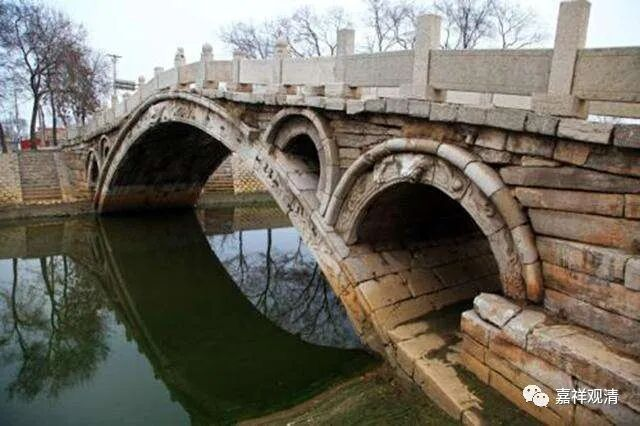

**《微课堂佛教史》248·1**

这些佛教史上的故事，很多都是因为当时的佛教水平不够，从而产生了一些莫名其妙的公案，比如说“船子德诚禅师为了要把佛教的生命留给夹山善会禅师，就自杀了”——这个是根本不成立的事情，胡说八道。禅宗里面这种故事虽然不能说比比皆是，但是捡起来的话好像也不少见，很多故事都是被歪曲了。（这个公案我们以后会说……）

那么，赵州从谂禅师还有一些什么故事呢？前面我们已经讲过“什么是赵州”，“如何是石桥”，是吧？“度驴度马”，是吧？还有一个什么呢？“吃茶去”。另外还有一个比较著名的公案，叫“庭前柏树子”。

这个是什么事情呢？说有人去问赵州从谂禅师：“如何是祖师西来意？”“祖师西来”就是指祖师从西面来到东土，就是达摩祖师他到中国来传了一个什么法。赵州禅师就回答说：“庭前柏树子。”

这个也是一个很有名的公案，其实后面还有半截。

对方就说：“和尚莫将境示人。”意思就是赵州从谂禅师你不要随随便便地就拿门口的这个东西来讲。赵州禅师说：“我不将境示人。”然后对方又问：“如何是祖师西来意？”赵州禅师答：“庭前柏树子。”

这也是一个著名的禅宗公案。

还有一个关于赵州从谂禅师的非常非常有名的公案，就是“赵州无”。有人问：“狗子还有佛性也无？”就是问狗有没有佛性。赵州禅师说：“无。”一般呢，公案就到此结束了。这个是无门慧开禅师的《禅宗无门关》当中这么写的：“狗子还有佛性也无？”“无。”这个公案就到此结束了，就参“狗子没有佛性”，这个称为叫“赵州无”。

实际上这个公案本身还有一个结尾的，就是对方又问了：“上至诸佛，下至蝼蚁，皆有佛性，狗子为甚么却无？”意思就是说，一切众生都有佛性，为什么你说狗子没有佛性呢？那么赵州禅师如何回答的呢？我记得曾经看到过一个说法，就是赵州禅师回答说“为伊不肯承当”。狗子为什么没有佛性呢？因为它不愿意（成佛），因为它不肯承当。现在我又看到这里有另外一个版本，这个版本里面赵州禅师是回答说“为伊有业识在”，就是它还有业识。这个版本，怎么说呢？反正我觉得还是“为伊不肯承当”更加有点说服力，是吧？

