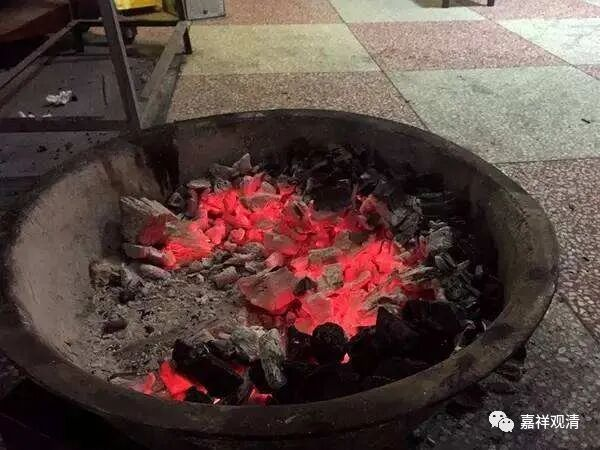

**《微课堂佛教史》250**

好，我们继续科学、唯物地讲佛教史。

现在还是讲禅宗史，禅宗史的内容实在太多了，有点讲不完。

昨天我们讲到了大珠慧海禅师，那么今天就来讲一讲沩山灵佑禅师。“沩”是三点水加一个为人民服务的那个为。禅宗后来分为“五家七宗”，沩仰宗也是其中的一宗，从“五家七宗”的角度来说，它可能是最早出现的一宗了。

沩山灵佑禅师的师父是百丈怀海禅师，百丈怀海禅师的师父是马祖道一禅师。

在马祖道一禅师的门下主要有“五家”当中的两支：一支是沩仰宗，另一支是临济宗。临济义玄禅师的师父是黄檗希运禅师，黄檗希运禅师和沩山灵佑禅师是同时代的，或者说他们是师兄弟。

沩仰宗的“沩”是指沩山灵佑禅师，“仰”是指仰山慧寂禅师。如果说要到仰山慧寂禅师出现才算形成沩仰宗的话，那么临济宗和沩仰宗的产生可以说是同时的。如果沩仰宗是从沩山灵佑禅师开始算的话，那么它产生的时代就比临济宗要稍微早一点。也可以说是“五家七宗”里面出现最早的一支。

沩山灵佑禅师也是福建人，俗姓赵，他也是在律师（建善寺法常律师）门下出家的，于杭州龙兴寺受具足戒。你们看，好像福建人都跑到浙江去了，前面那个大珠慧海禅师也是福建人，然后到了绍兴（当时叫越州）。沩山灵佑禅师到了杭州之后又再多走了一点，从杭州去到了江西，这个时候就遇到了百丈怀海禅师。

他和百丈怀海禅师有一个很重要的公案，这个公案应该怎么理解呢？我们不妨来理解一下。公案说有一次沩山灵佑禅师在百丈怀海禅师的身边，估计也是像我们现在这样的大冬天，百丈怀海禅师就让他去看看，说：“你去拨一下炉子里面，看看还有没有火。”沩山灵佑禅师就去拨了一拨，然后说：“没火。”意思就是没有火星，或者没有火炭。百丈怀海禅师就亲自过来拨了一下，然后发现了火炭，钳起来给他看，说：“你看，你还说没有？”

在禅宗的公案当中都说沩山灵佑禅师是这个时候开悟的。如果这样就开悟的话，开悟实在是也没什么东西，呵呵。很多人是这样说的，说这样是开悟的。如果这个真的是开悟的话，那开悟真的没啥东西啊。

实际上我认为没那么玄。这里是什么意思呢？实际上是老和尚在教育小和尚。小和尚不用心，就只是去稍微拨了几下，老和尚在边上一看，就看出来小和尚不用心，所以才会去深深地拨两下，然后指给他看：“你看看，刚才让你去看，你就拨一拨说没有火，那这个是什么呢？”小和尚在这个时候也可以是忏悔，也可以是说：“哦，我知道了，我以后要细心一点，努力一点。”这则故事实际上是这个意思，老和尚的意思就是小和尚不够细心，很粗心。

我的徒弟当中也有类似情况，这个故事我对他讲过好多回了，还是这样。你向他嘱咐去办一件事情，总是给你进行得拖泥带水，总是完成不了，最后要类似这样地去批评。

我觉得这个公案完全谈不上大家所认为的那种“开悟”，而这些情况呢，在我们身边都有。如果放在禅修上说，也是一样的。不是很努力，不是很专注——这种态度放在任何时候都是有问题的。我们一般的人就会被师父说不专心，有时候师父会说你粗心。

其实粗心这个词是给你一个台阶下，真正认真地去做事的话，是不会粗心的，粗心就是不把这个当回事情。好像六祖大师也曾经说过，真正的修禅要像什么呢？“一掴一掌血。”这个意思就是说，你必须很踏踏实实地做事，每一刻都是非常踏实地做事，不是这样随便应付的。老和尚说：“你帮我去看看，还有火吗？”小和尚就随便地拨弄两下。

你们大家可以想象一下这个场景：冬天的时候，老和尚在房间里穿着厚厚的棉袄，一个小和尚进来了。老和尚就说：“你去看一下，还有火吗？”小和尚拿着火钳随便拨两下，回答说：“没有火。” 老和尚一看他这么粗心的样子，就知道肯定不对，然后仔细翻了一下，夹起一块火炭来，问：“那这是什么呢？”大家能够理解吧，这种态度？其实我也经常会做这种事情的。

那么，据说沩山灵祐禅师就这样开悟了。我觉得这是禅宗外面很多人错误的理解，因为这个公案到这里其实还没有结束呢。我发觉很多人都是把公案只看一半，最重要的是他们其实根本就不看公案，光是听听而已，然后就对故事各种发挥。都识字的结果导致，现在外行都很爱插嘴……

