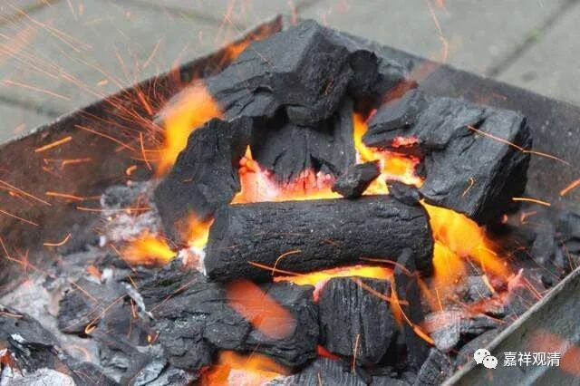

**《微课堂佛教史》251·1**

沩山灵祐禅师当时还是个小和尚，第二天他就跟着百丈怀海禅师去干活了，冬天还在干活。这个意思很明显，我们讲过百丈怀海禅师倡导“一日不作，一日不食”，是吧？

这个故事我们好像忘记讲了……

百丈怀海禅师一直有“一日不作，一日不食”的规矩，当他年纪大了的时候，大家就把他的劳动工具——如果是种地的话，就是锹、镐、钉耙等等这些干活的东西，给收起来了。意思是说：“老和尚你年纪那么大了，就别干活了。”结果那天百丈怀海禅师找不到工具，就没有干活，也一天不吃饭（够掘的），所以就留下了这句话——“一日不作，一日不食”。之后呢，大家只好把那些干活的工具还给他了，或者是拿出来了……

在禅宗里面是有这样的一种风气，不过我不知道现在还有没有这种情况。以前高旻寺的老和尚也是一样，八、九十岁了还是每天监督着大家劳动。当时寺院里面有一辆非常破的卡车，前面坐着一个司机，他就搬个椅子坐在后面的那个车厢里——其实也不叫车厢，就是小卡车的后面车斗里，然后寺院到处巡视（高旻寺很大），这里说说话，那里说说话。这个“说话”，其实就是批评或者指挥。那么，这也是禅宗的“一日不作，一日不食”的风格。

沩山灵祐这个小和尚——当时应该还没叫沩山，就是灵祐禅师，第二天又跟着百丈怀海禅师一起干活，估计还是在厨房里面干活。

然后，百丈怀海禅师又问他：“将得火来吗？”还能不能把火给我找来？

小和尚就说：“将得来，将得来。”

百丈怀海禅师就问：“在哪里呢？”

沩山灵祐禅师就拿起一枝柴，估计都是在厨房里面，吹了两下，然后交给了百丈怀海禅师。

百丈怀海禅师就给了一个评语，叫“如虫御木”。

“如虫御木”的后面是什么呢？“偶尔成文”。这个“如虫御木”是百丈怀海禅师的说法，后面半句被省略了，我们今天讲就是“歇后语”——“如虫御木，偶尔成文”。这个其实是在批评沩山灵佑禅师：“昨天我给你是这个样子，今天你还给我还是这个样子，你就不能举一反三？”

