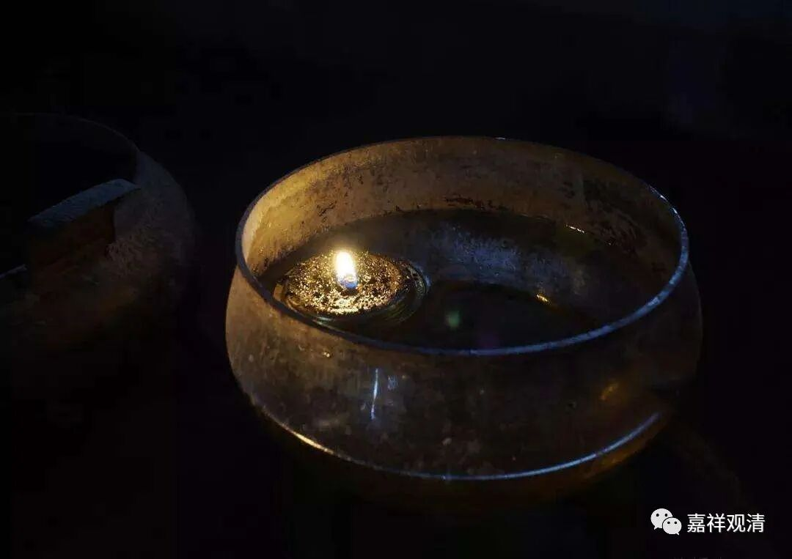

**《微课堂佛教史》252·1**

好，我们继续科学的禅宗史。

现在聊到沩山灵祐禅师，上次讲到他拨炭灰的故事，有人说这是他的开悟因缘。这个到底能不能算开悟因缘呢？至少江湖上已经有这样的说法了，我们也就不用过分多说了。

后来呢，沩山灵祐禅师就在百丈怀海禅师门下学习。结果又发生了一个故事，那也是比较重要的一件事情，说有个地方——估计应该就是沩山那个地方的人，过来找到百丈怀海禅师，意思是：“我们那里能不能请一位大师过去领众？”

现在也有这种情况的，前二、三十年各地都有这种情况，就是有些地方要恢复一个寺院，然后就去找一些wg里面没有还俗的老和尚：“老和尚，请您过来帮我们恢复恢复寺院吧。”有些老和尚就直接过去恢复寺院了，也有些老和尚就会在弟子中挑选一位，说：“你替我过去吧。”这里面又分两种情况：一种就是弟子直接过去了；另外一种就是“你替我过去，挂我的名字”，就是弟子过去，但是挂老和尚的名字。

那么这个时候呢，可能就是沩山当地的人，过来找百丈怀海禅师，问他能不能推荐一位弟子。然后百丈怀海禅师就手指着净瓶，在他的弟子当中进行了一个小测验。你们看，我们佛教当中经常拿瓶子作比喻，是吧？一说起来就是瓶子，一说起来又是瓶子，那瓶子是什么呢？它是佛教的一个法器，叫净瓶，出家了就知道了。

这个净瓶呢，和尚们身边就有。所以百丈怀海禅师就问大家：“不得唤作净瓶，汝唤作甚么？”他就问大家：“这个不能叫作净瓶，那叫作什么？”于是他的弟子们都来回答。沩山灵祐禅师呢，说是一脚踏倒净瓶，径直走出门了。百丈怀海禅师就说：“哎呀，输掉一座山。”意思就是让沩山灵祐禅师过去接庙——意思是“你赢了一座寺院”。

既然是让他去，应该是认可他的能力（禅宗里面师父的一个行为究竟是首肯还是批评，还真的不好说，但是一般来说我们还是把这个看作是对沩山灵祐禅师的认可）。那么，把净瓶踏破——这也是一个问题。如果是把净瓶踏破的话，可能当时大家都是盘腿坐着的，净瓶是放在地上的？如果净瓶是放在讲经的桌子上的话，不太可能踏破啊，所以可能就是大家当时是坐在地上的。这个净瓶不能叫作净瓶，那应该怎么叫呢？结果沩山灵祐禅师就直接把净瓶都踢翻了。这个事情应该怎么理解呢？还是大家各自理解吧。

（我说说我的理解看——百丈怀海禅师出题，明显是要在弟子中找一个人去住持丛林。沩山灵祐禅师所谓“踏倒净瓶”“径直出门”，我倒觉得是他不想住持丛林，直接走了……老和尚一看：嗯，有道心，不被世间所累！那就有劳你了！这种人才堪做一方首领！）

