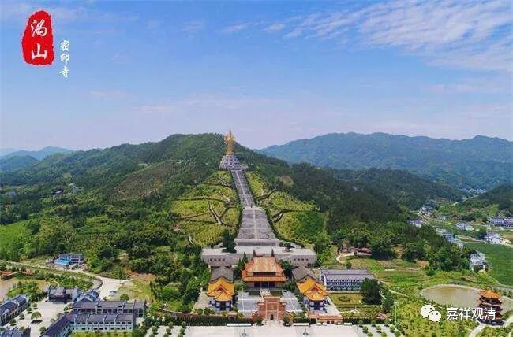

**《微课佛教史》252·2**

沩山灵祐禅师后来就去了沩山，在那里待了很长时间，但是寺院并没有恢复起来。沩山在哪里呢？沩山在长沙。我们一直讲，洪州禅——就是马祖道一禅师这一支，还包括石头系，主要弘法的地域就在江西和湖南。而大沩山就是在湖南长沙的附近，那里没什么人，很长一段时间里面都是挺荒漠的。

其实沩山灵祐禅师当时都差不多准备要走了，要撤了。就在这个时候呢，他的师父还是知道情况的，估计是不是有书信过去，或者是百丈怀海禅师的神通，也或者有来往的其他僧人传播消息。所以，百丈怀海禅师的另外一位大弟子——大安禅师就带着一帮人过来了……

大安禅师还不是自己一个人来的，是带着一帮人，帮忙建庙、弘法，相当于成为了首座。还过来和沩山灵祐禅师打招呼：“如果一旦我们这个寺院达到了一定的人数（五百人），你就要允许我可以自由地离开。”他的意思是很明显的：“我就是师父派来帮你的。”

由此也可以看到，有时候师兄弟之间还是需要互相帮衬帮衬，是吧？这个其实蛮重要的。出家人之间，或者大师们之间，如果互相能够有这样的赞叹等等……有句话说“若要佛法兴，就要僧赞僧”，是吧？如果有互相帮衬的，这样的道场就容易兴旺起来。这个方面我们就不多说了，如果要说的话是有很多话可以说的，现在就不多说了。

于是呢，沩山的这个道场就慢慢地兴盛起来，人也越来越多，开始聚集起来，名气也越来越大。这个时候呢，我们前面提到过的一位人物又出现了——裴休。裴休这个时候又到了长沙（前面我们讲裴休在南昌也待过，讲到他非常推崇黄檗希运禅师、圭峰宗密禅师）。沩山灵祐禅师和黄檗希运禅师是师兄弟，裴休就努力推出沩山灵祐禅师。

弘法，也是要看因缘的……

