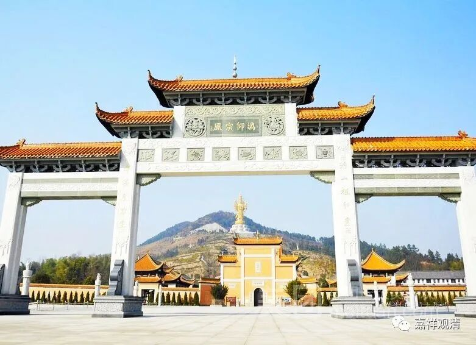

**《微课堂佛教史》253·1**

你们看，首先裴休是跟从菏泽神会大师这一系的圭峰宗密禅师学习过的，然后他又和百丈怀海禅师门下的黄檗希运禅师交好，而且也推荐过他，包括他到南昌、安徽的时候，都把黄檗希运禅师带过去……

现在他继续推出了百丈怀海禅师门下的沩山灵祐禅师。所以说，裴休在当时对佛教（特别是禅宗）是有着非常大的扶助的功劳。而在他的扶助之下，沩山灵祐禅师不管是道场也好，与士大夫们的关系也好，都发展得越来越好，这对佛教的弘法事业是有很大帮助的。

这个时候又有一件事情发生了，就是我们在前面也提到过的，同时出现的一个事件，是什么呢？就是“会昌法难”——唐武宗灭佛。

我们讲过，“会昌法难”对于经营佛教的打击是挺大的。这个行政命令呢，在北方的临济义玄禅师那边，北方的四个藩镇基本上不奉诏。北方三镇的胆子本来就有点大，三镇或者说四镇，就是河朔四镇，对吧？南方呢，在江西和湖南一带，灭佛运动执行得不像中原一带那么厉害，但是也不得不奉诏。毕竟皇帝的命令颁布下来，你不奉诏还是有点过分的。

那个时候呢，寺院被拆了，和尚们都被迫还俗，沩山临佑禅师就把头包起来了。把头包起来，意思就是他没有还俗——至少我们希望他还没有还俗，于是他就混迹于江湖之中，或者说混迹于人群之中。

“会昌法难”差不多持续了三年，“三武一宗”时期的法难所持续的时间都不长，而到了宋代和明代，其实法难的时间要更长。虽然说通常讲“三武一宗”的法难时间都不长，都是三年左右，但是都挺酷烈的。而后来那些法难的酷烈程度没那么强烈，但是持续的时间更长，这个反而有点麻烦。就有点像我们今天的流行病，如果它酷烈的程度强的话，它的传播力就不够，而如果它酷烈的程度弱的话，那传播力就很强。我们佛教受到的法难也差不多，如果它酷烈的程度不够的，但是时间长，这也挺麻烦的。

“会昌法难”之后，佛教很快得到恢复，因为后面的皇帝是唐宣宗。

我们讲过唐宣宗他本人是极信佛的，有些禅宗的传记里面甚至说他是出过家的。那么，唐玄宗是和“三论——牛头——径山系”有点关系，（当然三论——牛头——径山之间关系是相对松散的，还不是天台、临济这种自觉的宗派），所以他对禅宗还是有所扶植的。而刚才讲到的裴休，他后来也成为唐宣宗朝的宰相，对禅宗又比较感兴趣，所以禅宗在上层的扶植快速恢复……

