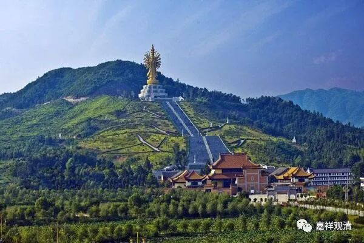

**《微课佛教史》253·2**

唐宣宗恢复佛教，那些唐武宗朝本来就对灭佛运动不太支持的南方节度使们，纷纷地开始扶植佛教、恢复寺院、聚集僧人……就找到了沩山灵祐禅师，请他继续住持沩山这个道场，修复或者新建寺院。

本来的寺院成批成批地被拆掉了，和尚们被迫还俗，这个时候又重新兴建了大型的寺院，寺院少儿出家人多，出家人就比较容易聚集，特别是最早修复的那些寺院，就最早出现出家人的聚集。就好像我们当代的WG以后，也是这样的情况——最早修复的或者是最早恢复的寺院，哪怕原先只是不起眼的小寺院，哪怕只盖了牛棚，甚至几十年的牛屎还没铲干净，周围的和尚们也会很快地聚拢过来。那个时候大家都很努力地修复寺院，修行也比较用功，日以继夜、夜以继日，因为都非常珍惜这么好的恢复佛教弘扬的机会。大家可以这么去理解唐武宗去世以后宣宗恢复佛教时的这种情况。

在沩山密印寺恢复不多久，沩山灵祐禅师就圆寂了。“会昌法难”结束的时候，沩山灵祐禅师差不多七十六岁，他圆寂的时候是八十三岁。所以他恢复道场那个时候都是一个老和尚了，就是重新请他出山的时候，按照以前的情况来说，七十六岁就已经是相当老的老和尚了，当然，老和尚会有一定的号召力。

另外一方面，沩山灵祐禅师这个时候还是和大安禅师在一起的，这就说明在“会昌法难”之前，沩山密印寺的僧人还没有达到当时大安禅师说的一定程度（五百人）。从前后的情况对照起来看，沩山寺或者沩山密印寺的人员聚集比较多的时候，实际上是在“会昌法难”以后，就是在寺院、教法恢复以后，人员的聚集比以前更多了，我们刚才也讲了原因。（如果要讲唐代的佛教史，“会昌法难”绝对不能绕过。）

沩山灵祐禅师八十三岁的时候圆寂，在大中七年（公元853年）。十年以后，就是咸通四年（公元863年），唐懿宗给沩山灵祐禅师赐了一个谥号——“大圆禅师”，塔额的名字叫“清净塔”。

撇出去一下……现存最早带年款的雕版印刷的《金刚经》也是在这之后出现的。可以说，现存最早带年款的雕版印刷的佛经从敦煌废纸堆里出来……它问世于公元868年……从咸通四年再加五年就是咸通九年。我现在手里有一个复制品，大家有机会可以来看一下。

好，今天就先到这里，谢谢大家！我们就把沩山灵祐禅师的事迹讲了一下，好像更多地讲了历史。

