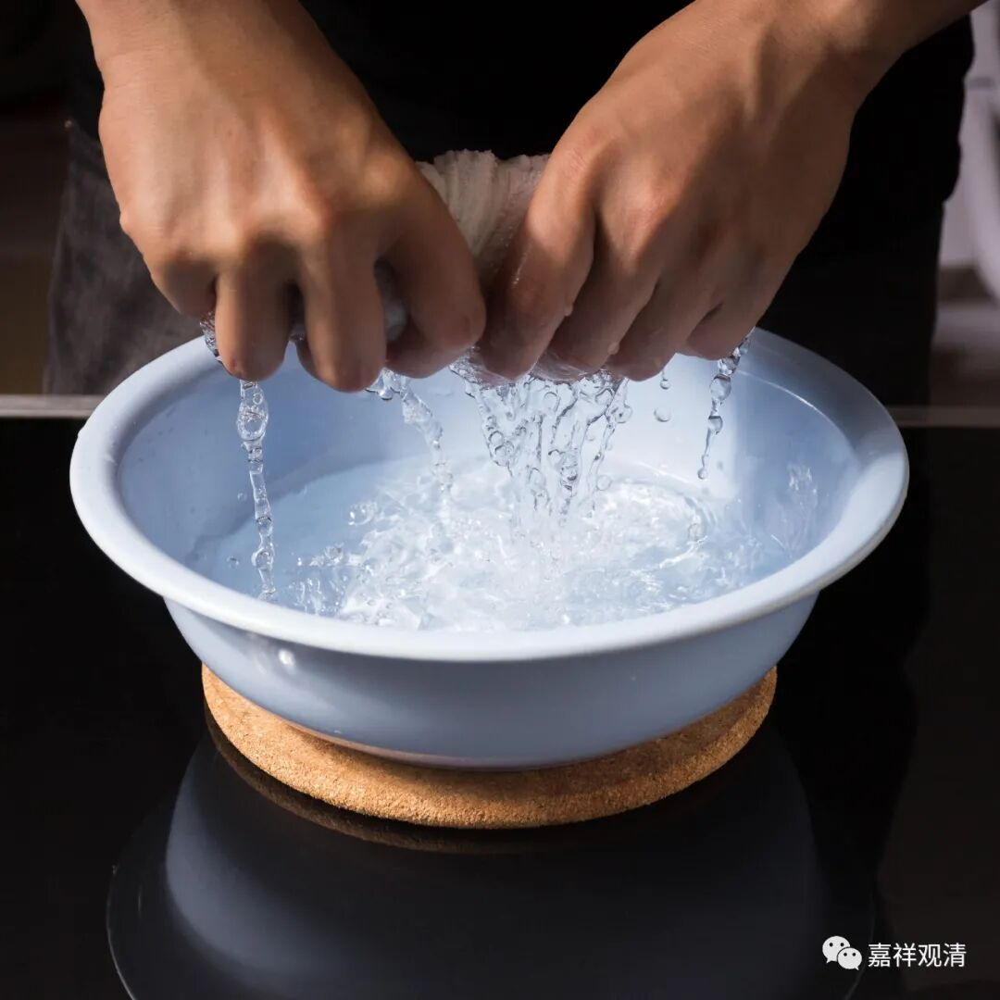

**《微课堂佛教史》254·1**

好，我们继续科学唯物地来讲禅宗史。

现在讲到沩仰宗的沩山灵祐禅师，昨天基本上把他主要的生平事迹讲完了，今天就讲几个他的故事好了。

昨天讲到他在“会昌法难”的时候，寺院被毁坏了，他就和大安禅师——就是沩山密印寺的首座，都用布裹头（看起来，他还是留了头发的）。唐宣宗继位以后，佛教又开始复兴，重新建造寺院等等。当时的地方官裴休就把沩山灵祐禅师迎请出来，而且是以自己的排场来迎接，就相当于今天用自己的轿车把他接出来。这个时候沩山灵祐禅师还留着头发，弟子们就一定要让他把头发剃了，他自己觉得剃不剃无所谓，但弟子一定坚持，他就剃了。

其实这段记载挺奇怪的，由此可以看到我们中国文人的恶趣味。这篇不是裴休写的，如果是裴休写的话，就会比较好一点。这篇是郑愚写的，他是当时的节度使，那么就请他给沩山灵祐禅师写一块碑，就是这篇《大圆禅师碑铭》。这块碑写得挺垃圾的，这是从我们佛教的角度来说，挺垃圾的，但他是节度使嘛，当时就请他写了。其实里面没写多少关于沩山灵祐禅师的内容，还不如他自己吐槽的东西多呢，在人家禅师的碑铭里面写了一堆自己吐槽的东西。这个也没办法，就是这些文人的恶趣味，他愿意关注的点就是头发剃不剃。

那么沩山灵祐禅师有一位弟子叫仰山慧寂禅师，这一支后来往下传承，就被称为沩仰宗。

我经常讲的一个故事就是吃茶的故事，说沩山灵祐禅师中午睡了个午觉，醒过来以后（估计这个时候还躺在床上），对着他的得意弟子——慧寂禅师（这个时候叫慧寂，还没到仰山）说：“刚才我做了一个梦，我给你讲一下，你给我圆一个梦吧。”然后慧寂禅师就去拿了一条手巾，打了一盆水，把手巾放在里面递了过来……这件事情就算过去了。

沩山灵祐禅师还有一位比较重要的弟子叫香严智闲禅师，等他来了之后，沩山灵祐禅师又说：“刚才我做了一个梦，我让慧寂小和尚给我圆梦，然后他就给我圆了个梦，那你来给我圆圆看。”香严禅师就回去泡了一杯茶端上来。

山灵祐禅师就非常高兴，说：“我这两个弟子聪明得就像舍利弗（鹫子）一样。”“鹫子”就是舍利弗，“鹫”就是灵鹫山的鹫。他就夸奖两名弟子聪明得像舍利弗一样。

很多人都把这个故事讲得玄之又玄，我给大家讲过这个故事，其实这个故事很简单的。就是一位老和尚中午做了个梦，然后想让徒弟去给他圆梦，前面一个徒弟给他打了盆水，递上毛巾，后面一个徒弟给他泡了碗茶过来。什么意思呢？其实两个人的意思是一样的，前面一个就是：“师父，你还没睡醒，要不清醒一下？用冷水洗洗脸？”后面一个意思就是：“师父，喝点茶，清醒一下。”这里面并没有玄之又玄的内容，没有那些什么法身、体用等等的解读（至少像我这种水平不高的人解读不出来这些东西，我只能解读到这个程度）。

唉，我现在要是跟几个徒弟说“刚才我做了一个梦……”，他们一定都是A、星星眼；+B、汉奸相；+C、流着口水，问：“什么梦啊什么梦啊……”唉，我这一支禅宗的香火，眼看着是要断在我手里啊……

