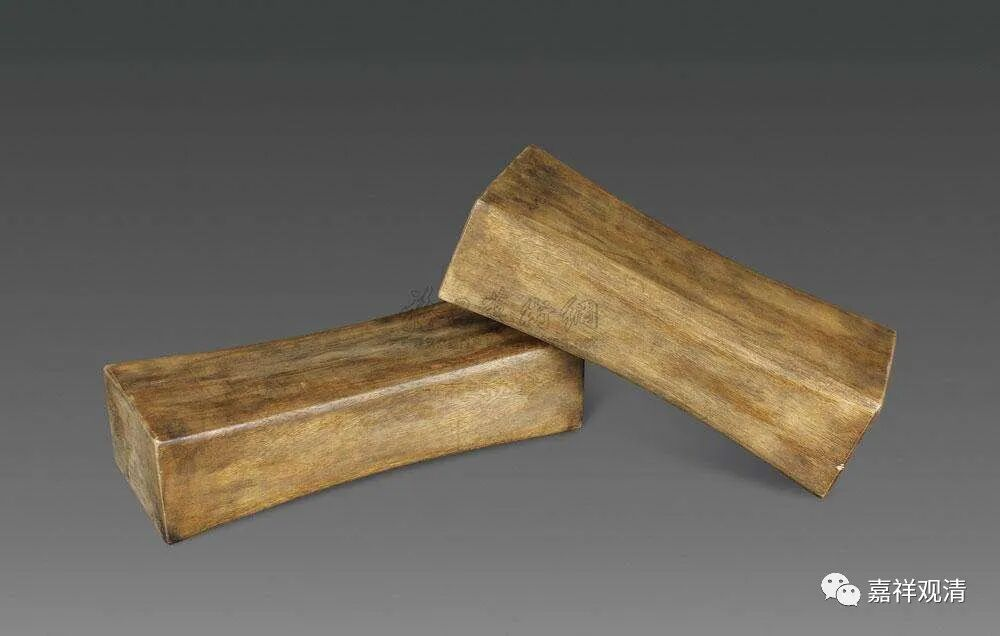

**《微课佛教史》254·2**

其实禅师们都是很平实的，哪有这么多玄之又玄的东西？如果师父天天跟你玩那些玄之又玄的东西，这种师父……我觉得你们还是早点离开。真的没有意义，玩这些干嘛，对吧？大家猜谜语，干嘛呢？许多禅宗故事并没有这方面的意思。

沩山灵祐禅师还有一个故事，我还是要先说一下——实际上我已经讲过很多次了，这两天我推送出来的很多是禅宗故事，大家可能觉得这些是历史的事实，其实并不是这样的。比如说沩山灵祐禅师和仰山慧寂禅师这两位都是唐代的，但是仰山慧寂禅师的语录一直到明代才被结集出来，所以很多故事不见得是真的。

其中有一个故事也是这样，说沩山灵祐禅师对仰山慧寂禅师说“小沙弥如何如何”，这个故事呢，如果你是研究历史的话，你就知道不可能存在的。为什么？因为仰山慧寂禅师做沙弥的时候，并不是在沩山禅师这里，他到沩山禅师这里的时候年纪已经很大了，或者说年纪至少不轻了，是在外面已经逛了一圈。他出家的年纪也不小的，所以“小沙弥”这种称谓的故事，肯定不是原始的，有些故事就是后人编的。很多人都把这些故事讲得玄之又玄的，还有什么体用等等，我头都大了，其实没那么复杂。

我们再讲一个故事，还是关于茶的故事，先讲一下禅宗的公案。说沩山灵祐禅师与仰山慧寂禅师都在摘茶，沩山就对仰山说：“终日摘茶，只闻子声，不见子形。”整天地摘茶叶，只听到你的声音，看不到你的样子。

“仰撼茶树。” 仰山就去摇了摇茶树。

沩山就说：“子只得其用，不得其体。”你只得其用，不得其体。

那么仰山就问沩山说：“未审和尚如何？”和尚您怎么样呢？

“沩良久。”不说话，“良久”可以是不说话的意思。

“仰曰：‘和尚只得其体，不得其用。’”

现在的说法就是以此故事作为基础，大家都在那里开吹，说仰山和沩山如何地谈体用。实际上这是一个小得不能再小的事情，但是大家却在那里瞎吹，这种禅宗不学也罢！人家这个故事没有那么复杂，即使有点复杂的话，也没有现在所想象的那么复杂。

这个故事就是两个人在摘茶，这个茶估计是乔木的茶叶，故事本身的意思很简单的，如果你们到我庙里摘过茶就知道了。俩人一边摘茶，一边可能在聊天，师父说：“我只听到你的声音，看不到你的人，你在哪里？”差不多就这个意思。那他的徒弟就在那里把树摇一摇，那就知道他在哪里了，是吧？所谓的“只得其用，不得其体”，意思就是我知道你在哪里，但是你的样子我没看到，人我还是没见到。就这么点意思。后来徒弟回过来再问“和尚如何”，师父在那里不说话，徒弟就说“只得其体，不得其用”，就是我不知道你在那里在干嘛，是吧？差不多这样的意思。至于所谓的体用，应该根本没有那种玄之又玄的东西。

我还是这么讲，这些故事本来只是禅师在当时说两句话，后来就把它们搞成所谓的公案去参，就相当于把《老子》、《庄子》里面的一些寓言拿去参，这有意义吗？不见得有意义，就像前面讲过的“如虫御木，偶尔成文”。

刚才讲沩山灵祐禅师睡觉醒来之后仰山禅师给他打了把毛巾的故事，后来在仰山禅师身上也有类似的故事。先是“沩”，再是“仰”，所以他们这一支就叫沩仰宗。

仰山禅师有一次躺着，弟子在边上，就问他：“法身还解说法也无？”就是问法身说不说法。仰山就回答说：“我说不得，别有一个人说得。”然后弟子就问：“谁说得？说得的人在哪里？”仰山就把枕头推给他了。

他的师父沩山灵祐禅师对这件事情有一个评价，说这个是“剑刃上事”。其实这个故事就跟前面那个故事一样，没那么复杂。法身怎么说法？法身本来当然是没办法说法的，你要说法身说法，那不是做梦吗？所以就把枕头推给他。法身说法——法身怎么说？法身是无为法，是吧？无为法，怎么说法呢？说法，都是有为法，你要说法身说法，那你就做梦去吧！于是就把枕头推给他了，就这个意思。

后人都是把这些故事想多了，总共就那么几个公案，居然开始写论文——“沩仰宗的体与用”，简直莫名其妙！这种人就应该送他一个枕头——梦里啥都有！

今天先讲这几个故事，谢谢大家！

