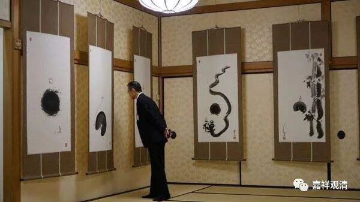

**《微课佛教史》255·2**

仰山慧寂禅师在耽源禅师那里学习了几年，学有所得……后来呢，仰山慧寂禅师就去了沩山，给沩山灵祐禅师做侍者，“侍巾瓶”——“巾”应该是毛巾吧，“瓶”就是净瓶，可以理解为他在沩山灵祐禅师身边侍奉作息，也就是做侍者，大约十四、五年的时间，都在沩山灵祐禅师门下。

我昨天讲过了，有一些语录当中说沩山灵祐禅师管仰山慧寂禅师叫“沙弥”，这是不对的，一看就是编的故事。这又是怎么来的呢？实际上编故事的人也是有文化的，但是——第一，他是“编”故事；第二，他用的书不对，比如他用的是《释氏稽古略》，那根据这本书里讲，仰山慧寂禅师在沩山灵祐禅师门下的时候的确只有十岁刚出头，所以，编这个故事的人，年代他们倒是很认真地去查了。怎么说呢？编故事的人也是算了一下年代的，但是他算的这个年代更加说明他是编的了，因为他找错书了，对吧？

仰山慧寂禅师在十八岁的时候去了耽源山，待了几年，已经是二十几岁了，然后在沩山灵祐禅师门下学习了十四、五年，等他离开沩山灵祐禅师的时候，差不多都要四十岁出头了。但如果按照《释氏稽古略》的说法，沩山灵祐禅师圆寂的时候，他才十五岁。这都相差二十五年了，肯定不对！

所以我不断地在提醒大家：我们在科学唯物地讲佛教史的时候，我发现很多和尚们自己写的佛教历史或者说一些文献，你们是不能把它们当作历史看待的，或者说和尚们确实有一些编造历史的痕迹。这在禅宗里面是特别明显的，为什么呢？因为禅宗后期的语录创作，有很多人进来参与。其中一些比较外行的人——根本不是佛教圈子里面的人，也参与了语录的创造，甚至勒于石碑铭的写作也偏向于故事。

在佛教界还有一个情况，就是前两年发生在西安的事情——一块碑没有了，然后又按照（比如说《高僧传》或者其他记载）碑文的著录重新刻一块碑，但是后人重刻的这块碑，文字却不照原来的碑去复制。或者这个时候有些人再手欠一点，就会在碑文里面出现很多“新东西”。

上次我还提到过另外一件事情，就是有些人为了让自己门派的祖师爷看起来更加风光，就帮祖师爷编造出来几个大徒弟，那些徒弟事实上根本是不存在的，都是编出来的，多出来几个人，以示自己门派非常的兴盛。

