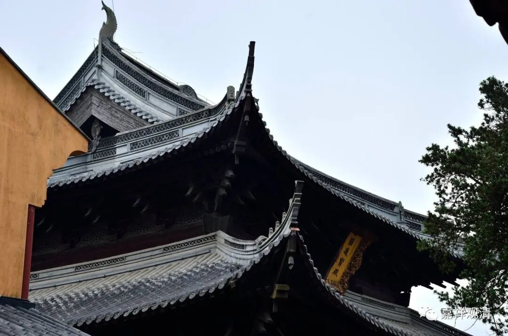

**《微课佛教史》256·2**

由于禅宗内部系统性的、理论化的文字著作很少，所以很多人就用这些禅宗的公案、语录去反推他们的思想，这是一种没办法的办法，但事实证明是很不靠谱的。

我们现在的一些冒充学者的和尚们也出现了这种情况，比如前一段时间——哎呀！我要是专门点名的话就不太好了，反正某某人就专门把历史上某位禅师的文字拿出来“诠释”（我注）一番，就把那位禅师捧成某某学派，然后因为自己专门研究这个，就把自己也封了专家——这个名字还是真的不好提。就差不多这个意思吧，自己摇身一变成了研究某个领域的专家。其实这些老禅师们有没有这种意思都是问题呢。

有些公案、禅话的内容其实就是泛泛而谈的，起初被《我的某某老师》或者《某某先生二三事》这样的文章记录下来，后来的灯录编撰者就依此而丰富（并合理化）了更多内容。于是在传记当中就表现出复杂的“体系”，好像他在某一方面确实有特别的讲究。比如说在仰山禅师的故事当中，我可以举几个例子，都是完全可以表现为公案之间的前后联系，但又不那么真实的故事。

我举一个例子，先讲仰山慧寂禅师上堂的一些说法，这个只是他上堂的一些记录。他说：“我今分明向汝说圣边事，”我来给你们讲讲“圣边事”——也就是胜义谛，差不多可以这么理解。

“且莫将心凑泊。”可以理解为不要太啰嗦，不要太折腾。

“但向自己性海，如实而修，”好好地去修习就可以了。“性海”，可以说是实际上该怎么修就怎么修。

“不要三明六通。”不要太关注“三明六通”。当然，仰山禅师虽然不是教下的，这个“三明六通”他还是知道的。但是你不能说他这句话的意思是不要漏尽通，不是这个意思啊。就是说让你不要去看那种神通的事情。

“何以故？此是圣末边事。”为什么呢？这个神通，并不是真正要求的。对于禅宗来讲，真正要求的是明心见性，或者是见道，或者是解脱，这些才是。所以，要怎么样呢？

“如今且要识心达本，但得其本，不愁其末。”

这些是仰山禅师“上堂”的法语，这个几乎可以算是当场记录的文字。

后来不管是古人还是现代人，都觉得这是“仰山禅师的特色”。其实这哪是特色呀，谁都应该这么讲的嘛，我的师父也是这么讲的嘛：“你要神通干吗呢？其实这（神通）也挺啰嗦的，是吧？最重要的是解脱，你的解脱才是最重要的。”——谁不是这么讲呢？把这些当作是“仰山禅师的特色”的人，佛教对于他，都是从未梦到过的东西！

