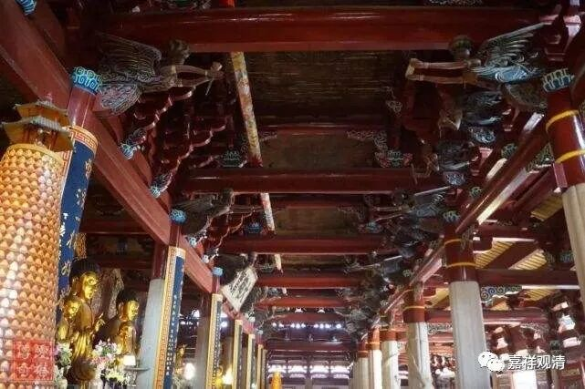

**《微课堂佛教史》257·1**

于是呢，就有人编出了一个故事，这个故事很明显是编的，我们来看看是什么故事。

“有梵师，”就是有天竺的人，“从空而至。”从天空中降下来。

“师曰：‘近离甚处？’”慧寂禅师就问他：“Hello. Where are you from？”你从哪里来？

“曰西天。”我从天竺来。这个很有趣啊！两个人居然是用汉语在对话，而且还知道汉语的说法。

“师曰：‘几时离彼？’”然后慧寂禅师就问他：“什么时候离开的啊？”

“曰今早。”说是今天早上。

“师曰：‘何太迟生？’”慧寂禅师就说：“哎呀！你怎么来得这么慢呢？”呵呵，这个也很会说话，说他速度太慢了。

“曰游山玩水。”然后那个印度人就说：“我这一路上游山玩水，所以来得晚了。”

 “师曰：‘神通游戏则不无，阇黎佛法须还老僧始得。”慧寂禅师是什么意思呢？就是神通你是有的，我们看到了。但是佛法你没有，佛法还须在我这里。

然后梵僧——那个从天而降的印度和尚就说：“特来东土礼文殊，却遇小释迦。”我是来“礼文殊”的。为什么要“礼文殊”呢？有些人说：“文殊在印度有，还需要到中国来礼吗？”这不是废话吗，对吧？实际上当时的印度、尼泊尔等等确实有这个习惯，有梵僧到中国——主要是五台山——去专门礼拜文殊。这个情况是真实有的。

 “遂出梵书贝多叶与师，作礼乘空而去。”梵僧就拿出《贝叶经》交给慧寂禅师，然后“作礼”——磕头，“乘空而去”，又飞走了。“自此号小释迦。”从此慧寂禅师就被称为“小释迦”。

大家还记得我们前面讲过谁有类似的故事吗？黄檗希运禅师，是吧？黄檗希运禅师是他的师叔。有一次过河的时候，看到一位梵僧过河玩神通，就批评他：“小乘！玩神通。”这个是佛教一贯的思路。

这个故事估计是后来被编出来的，主要是为了去对应上面那个“神通不如解脱”的说法。其实这是佛教里面的一种通说，后人不知道或者后人不学习，还把这个特别当回事儿，还去编故事捧祖师——没必要！

