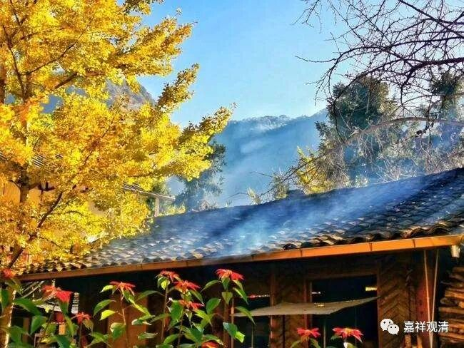

**《微课佛教史》259·2**

丹霞天然禅师到了湖南的石头希迁禅师那里作了三年净人（出家的考察阶段），都没有给他剃头。那天，石头希迁禅师就说：“明天我们把大殿前面的草除一下（用后来禅门里的“行话”来说，就是“明天出坡”）。”

第二天大家除草的时候，丹霞天然禅师就端了一个面盆，把头洗干净了，拿了把剃刀，到石头希迁禅师面前去了。石头希迁禅师笑了，就给他剃了头发。后来要给他讲关于戒律的内容，他也不听，“掩耳而去”，捂着耳朵就走了，说明他有点个性。

他去到哪里呢？又回马祖道一禅师那里去了。到底是不听戒律直接走了呢，还是过了一段时间才走的呢？可能还是过一段时间才去的马祖道一禅师那里。

他到了马祖道一禅师那里，一进大殿，就骑到佛像的头上去了，应该是抱着佛像的头，骑到佛像的肩膀上去了。

其他的和尚们都吓死了，赶紧把马祖道一禅师找来。然后，马祖道一禅师就说：“我子天然。”就是说他很天真。（其实说起来，为什么不可以是“我自天然”呢？！说的话是声音，不是文字。）那个时候丹霞天然禅师还没有名字，按照这个故事的说法，丹霞天然禅师就下地礼拜曰：“谢师赐名。”谢谢师父赐给法号。从此就叫“天然”。

这又是天然禅师的一则故事。

但是这故事很可能也是后期才出来的。为什么呢？因为《宋高僧传》（虽然我们很看不上）说天然这个名字是石头希迁禅师给取的。如果是这样的话，这则故事（马祖道一禅师取名）就很可能还是后期编的，可能是为了让丹霞天然禅师烧木头佛像的故事来得更加顺理成章一点，就把他坐在佛像肩膀上的故事也一起编出来，好像这样就表现了人的一贯性。

当然，我也没有说这个故事就一定是假的。但是两个记载不一样，从这个角度来看，甚至也未必是有坐到佛像的肩膀上去抱着脑袋这个故事。在我们这里长期听课的人应该都已经发现了，禅宗后来的一些故事，其实文学性很强，我们不能把它们当作历史来看，更多的应该是一种故事。

因为群里又有新人进来，我可能还要提醒这一点。否则的话，新人过来一听，会觉得：“咦，怎么老是批评以前的记载？”其实，禅宗的灯录等等的记载，并不是历史，而是故事，有些是相当于寓言故事，就像《庄子》（禅宗里很多内容也确实很“庄子”）。

