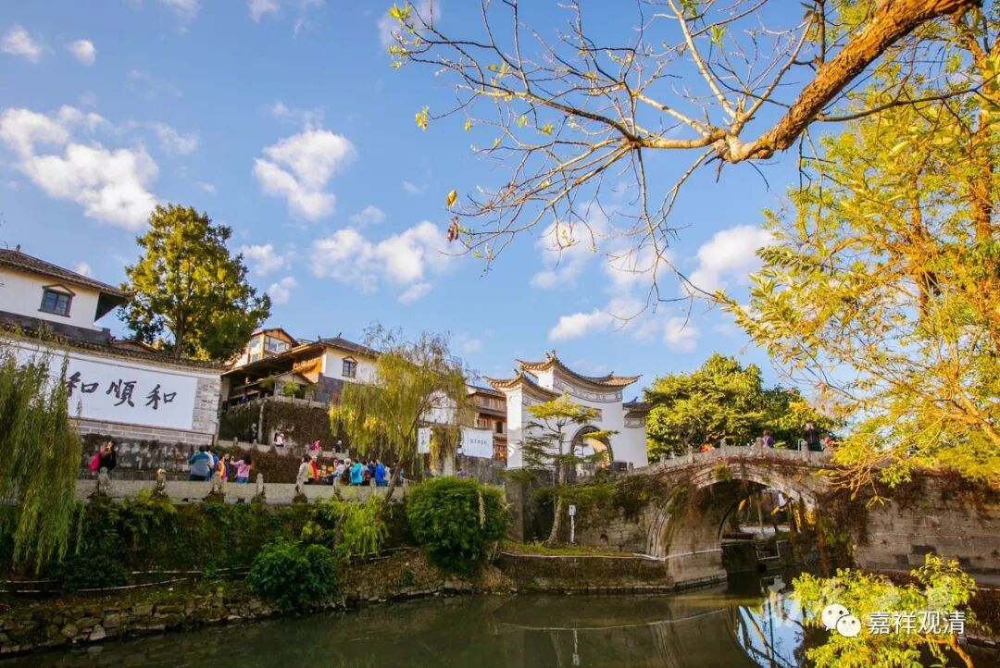
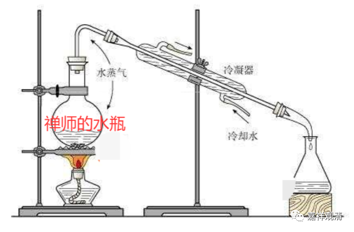

**《微课堂佛教史》261·1**

邓隐峰禅师在我们看起来是有点闯祸胚的感觉，跟那个丹霞天然禅师差不多。

有一次，马祖道一禅师在路边坐着，把脚伸了出来。邓隐峰禅师正好推着个车过来，就对马祖道一禅师说：“大师，请把脚缩一缩。”

马祖道一禅师说：“已展不缩。”我脚已经伸了，就不缩了。

然后，那时候应该还是个小朋友的邓隐峰禅师就说：“既然你已伸不缩，那我就已进不退。”我进了就不退，就把小车从马祖道一禅师的脚上碾过去了。

马祖道一禅师回到法堂准备讲课的时候，拿出了一把斧子说：“刚才哪个人压了老僧的脚，站出来！”

邓隐峰便直接站出来，把脖子递到马祖道一禅师的斧头前面。

马祖道一禅师也就算了——当然，这是我的解释，“也就算了”。原文里面是“师乃置斧”，就是马祖道一禅师把斧子放下了。我觉得也就是算了的意思，还能怎么样呢，是吧？

所以，看你怎么理解了。你们如果认为是禅机的话，那可能就是禅机；你们如果觉得这不是禅机的话，那我也觉得这正好对应了邓隐峰禅师之前的情况。他小时候比较虎，可能从小就是个闯祸胚，父母看到实在受不了，出家就出家吧。

邓隐峰禅师走动的地方挺多的，有一次到南泉普愿禅师那里去了。南泉普愿禅师说：“不要动这个铜瓶。瓶里有水，把那个水给我倒过来。”然后邓隐峰禅师就把铜瓶拿起来，直接把水倒在南泉普愿禅师前面，南泉普愿禅师也拿他没辙。

如果南泉普院禅师问我，那可就简单了，我给他来个物理实验——

Look——

当然这是开个玩笑啦，哈哈哈哈……

如果单纯一点来看这个故事的话，邓隐峰禅师就是根本不理睬南泉普愿禅师说的话，和他说不要动这个瓶子他偏动。这个故事也是一样，你们可以把它理解为蕴含了禅机，也可以理解为邓隐峰禅师有点虎。《灯录》里说“泉便休”，这个“休”字当然也可以有几种不同的理解，不见得是认可的意思。

