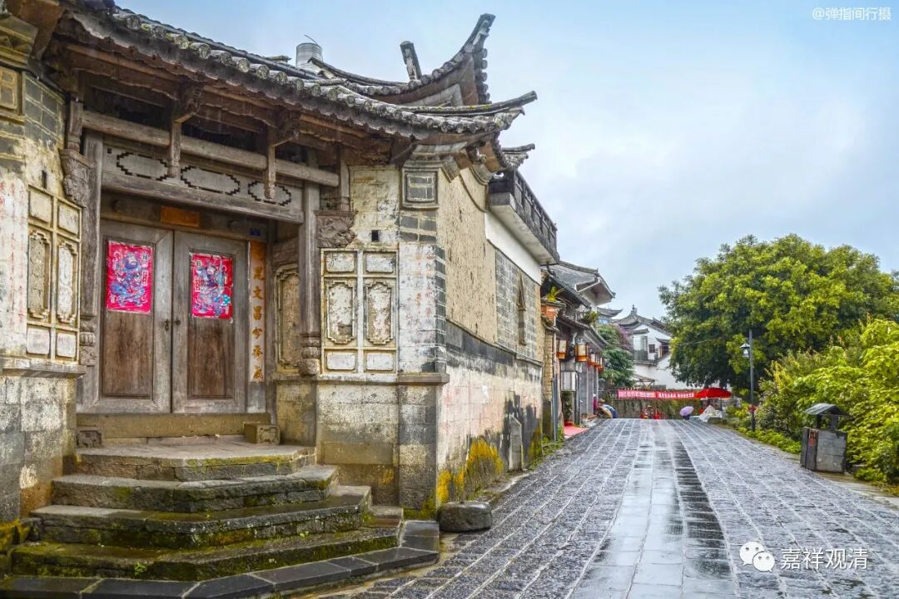

**《微课佛教史》261·2**

我们再讲一个故事。

邓隐峰禅师来到沩山灵祐禅师那里。对于沩山禅师来说，他邓隐峰是师叔，因为沩山禅师是百丈怀海禅师的弟子，而百丈怀海禅师也是马祖道一禅师的弟子，对吧？邓隐峰禅师一到那里，就把衣钵放下来，跑到禅堂（我们就把这个“堂”理解为禅堂吧）里面去了。

沩山禅师一听说师叔到了，赶紧把衣服穿好，去到禅堂里面看。结果邓隐峰禅师怎么样呢？他也不管，就在那里躺着，也不起来。沩山禅师看着没动静，就自己回了方丈。邓隐峰禅师呢，就这样走了。

过了一会儿，沩山禅师就问侍者（这个侍者不知道是不是仰山禅师）：“师叔在吗？”

侍者回答说：“师叔已经走了。”

沩山禅师再问：“师叔去的时候有没有留下什么话呢？”

侍者说：“没有什么话。”

沩山禅师说：“别说没有什么话，其声如雷。”他的声音太响了。（这个“其声如雷”，也是要看大家怎么理解，我们在这里只是讲故事而已。）

总之呢，邓隐峰禅师是一位比较有想法，而且行为上比较古怪一点的禅师，和之前所讲的丹霞天然禅师有得一拼。

前面讲到的邓隐峰禅师的这些故事好像都是和马祖道一禅师有关，再讲一个和石头希迁禅师有关系的故事。

有一次，大家出坡干活——锄草，邓隐峰禅师站就在边上，叉着手。我也不知道这个“叉着手”是什么意思。“叉着手”是不是恭敬地站着？就像孔老爷子那样叉手而立。也可能就是他没在干活吧，就在那儿看着。

石头希迁禅师就拿把铲子把邓隐峰禅师面前的草铲了一块出去，于是他就对石头希迁禅师说：“你铲了这一块，没有铲那一块。”石头希迁禅师就把铲子给他了，然后他也去铲了一下。石头希迁禅师就说了：“你铲了那块，又没铲这块。”

哈哈……也许这里面有双关语吧。我觉得这个双关语可以有很多理解，你们可以自己去理解，也可能就是传记当中最初说的，人比较虎一点，不够聪明，或者是太调皮了，都有可能。

这就是邓隐峰禅师的故事。

后期的禅师们认为邓隐峰禅师最终是没有开悟的，而且是不止一位后期的比较著名的禅师这样认为，有人评论说他并没有拿到最后一招什么的。在禅宗的历史当中这样来写他，那就是存在几种可能的。有一种就是可能他确实开悟了，或者有人认为他前面在来回走的时候并没有开悟，后来好像碰到一件什么事情（具体我忘了），有人就说这个时候是开悟了。我们好像不知道应该怎么理解他们所说的这种开悟。

好，今天我们先讲到这里。邓隐峰禅师，也是和前面所讲的丹霞天然禅师差不多的一位行事比较怪异的禅师。

好，先到这里，谢谢大家！

