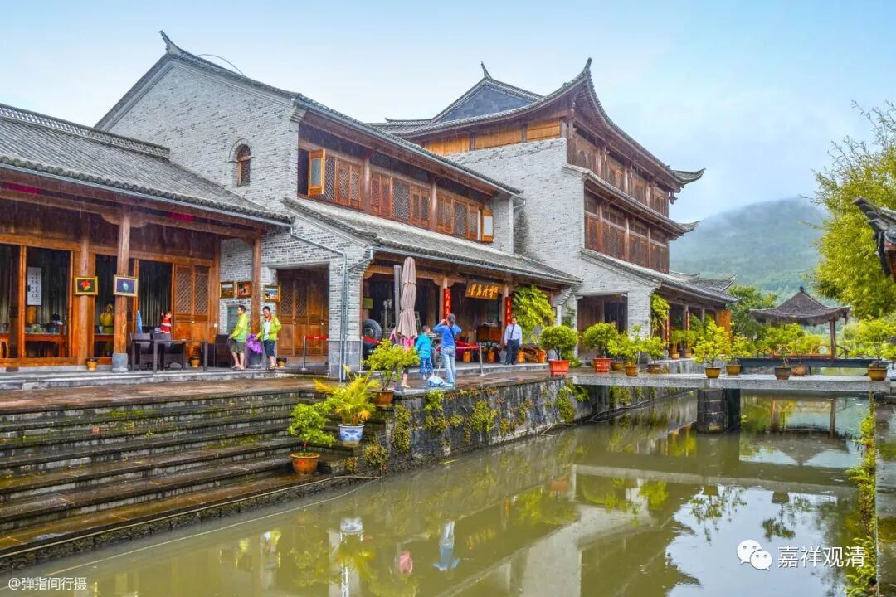

**《微课堂佛教史》262·1**

好，我们继续讲讲佛教的禅宗史。

我的讲课方式对一般的人听起来可能会觉得比较新奇，但是对于真的研究禅宗史的人来说都是比较常见的，当然，其中也不乏比较新颖的内容。可是呢，也有些人不太能够理解，我已经说过了，如果不理解的话你就当作故事听听也行，或者不爱听的话，不听也行。

今天我们来讲谁呢？讲另外一位大师——药山惟俨禅师。

药山惟俨禅师和潮州有点关系。他俗家姓什么呢？他俗家姓韩。哈哈，潮州那里有条江叫韩江，是吧？不过那个“韩”是韩愈的韩。有些版本说他姓寒，就是冬天寒冷的寒，但是这个说法应该有点问题。据说这种说法是出自《宋高僧传》，——《宋高僧传》：“释惟俨，俗姓寒……”估计是口耳传说的记录，寒韩不分。

关于药山惟俨禅师的记载在不同的典籍当中有很多不同之处，也有一些矛盾之处。所以，即便他身处唐代，即便在我们中国这个历史记载如此丰富的国度当中，也仍然存在很多的问题。（后面还有其他禅师的传记出现了更大的问题，相对来说，药山惟俨禅师这个问题还不算大呢。）

药山惟俨禅师比较重要的贡献是什么呢？在他门下开出了曹洞宗，所以他成为了禅宗史上一位比较重要的人物。

前面我们讲过丹霞天然禅师和邓隐峰禅师，他们两位都有一个相同的情况，是什么呢？就是既在马祖道一禅师门下待过，又在石头希迁禅师门下待过。那么药山惟俨禅师也是这样，往来于两位大师之间。至于说到他的嗣法，是说他嗣石头希迁禅师的。

关于药山惟俨禅师的传记有很多嘛，也有传记当中根本就没提到石头希迁禅师的，也有传记根本就没提到马祖道一禅师的，都有。后世总的理解是他在两位大师那里都学习过，这个应该是符合当时的情况的。前面我们也讲过，好多的禅师都有这种情况，当时两位大师分别在两个地方——江西和湖南，大家是两地都参访（走江湖），而且还不仅仅去一次。

