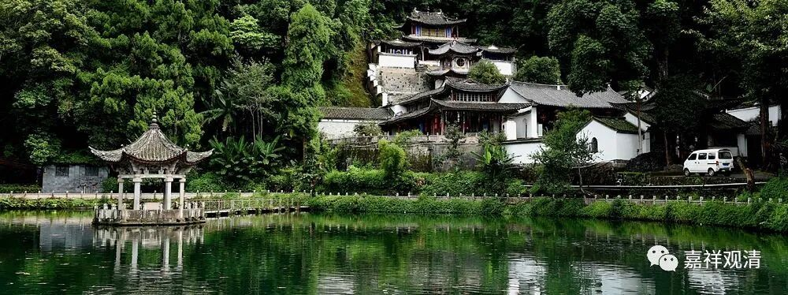

**《微课佛教史》261·2**

我们前面讲了，药山惟俨禅师俗姓韩，说他是绛州人，是在山西。但是很有趣的是，他在十七岁的时候就去了潮州，这两个地方相距有点远啊。我不知道大家有没有考证过，药山惟俨禅师为什么从山西跑到潮州那么远的地方去。

药山惟俨禅师在潮州出家，投入潮阳西山的慧照禅师门下，受具足戒的时候又去了南岳衡山的衡岳寺，从希操律师受具足戒。有些地方的记载是希澡律师，还有些地方是智澡律师，搞不清楚了（希操、希澡、智澡手写起来也很像），反正就是到那个律师那里去受了比丘戒。之后呢，药山惟俨禅师就地跟着石头希迁禅师去学习了，随后又跟马祖道一禅师学习，然后再回到石头希迁禅师处学习。

药山惟俨禅师在经论方面的学习也是非常扎实的，虽然不太清楚他是跟谁学习的，但是在经论方面的学问应该是很不错的，为什么呢？因为他的门下有一位比较重要的弟子，这位弟子和中国思想史有点关系，就是当时的国子博士，叫李翱，有一本中国思想史上有名的《复性书》就是李翱写的。而这位李翱呢，是在药山惟俨禅师门下持弟子礼的，据说《复性书》的写作受到了惟俨禅师的启发。（李翱的《复性书》，大家如果有兴趣的话可以去看看。）所以呢，药山惟俨禅师在经论方面的水平实际上是非常高的，不然也收服不了李翱。

但是呢，又有一个奇怪的情况——正是（有文化的）药山惟俨禅师所留下的文字，（至少间接）造成了禅宗末流的不学习、不看书的毛病。可是实际上，恐怕是（半文盲们都）没有看懂祖师的原意。

后来关于药山惟俨禅师有一个经典的故事，说他平时不让弟子们看书，是不让弟子们看经论的。而在药山惟俨禅师的碑文中说，他对于佛教经典都学习得很好，根据我们刚才讲的这些情况，也确实如此。但是呢，在《传灯录》当中记载着这样一个故事，这个故事也流传得比较广。

“师看经，”就说药山惟俨禅师看经，“有僧问：”就有人问：“和尚寻常不许人看经，为什么却自看？”师父啊，你平时不让别人看经，你自己为什么看呢？“师曰：‘我只图遮眼。’”我只是拿本经书来遮遮眼。

半文盲们这就算找到理由，不看书了！呵呵，其实就是本来不想学习罢了！

