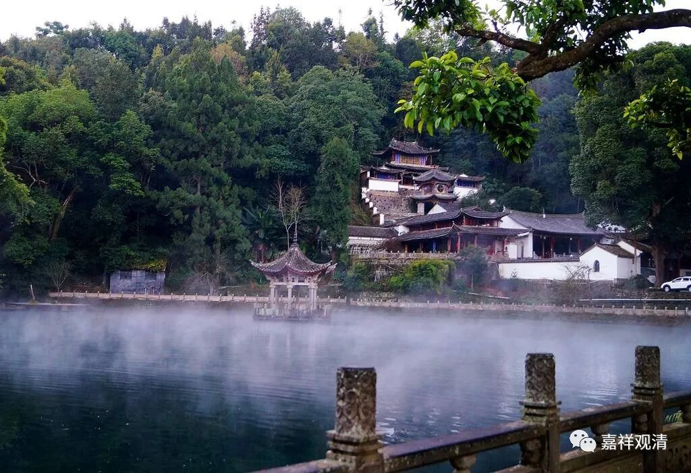

**《微课佛教史》263·2**

药山惟俨禅师学习的时候，关于他为什么后来去学习禅宗，就曾留下过一句话：“大丈夫当离法自净，焉能屑屑于细事？”这句话在他的不同传记当中有不同的文字开合，或者个别字不一样，或者一些字不一样。但是我觉得就刚才我念的这句话，在意思上是可以理解的。他的意思就是说：在学习了很多内容以后，怎么能着眼于这些细碎的冗余知识呢？

比如说我们学习阿毗达摩，确实会发现有些东西过于细屑，过于细碎了。研究这些细碎的东西，作为宗徒——某个宗派的门徒，固然并无不可，但说实话，从某些角度上来看，花那么大的精力去推测一些佛陀并没有说过的小事情，是不是有这么大的意义呢？我相信可能很多人都有过这样的一些经历，而且在中国历史上这样的人应该也不少。

当然，这个事情也确实需要两头说。如果你没有去深入学习过的话，你也说不出来这样的话，是吧？我们讲，如果药山惟俨禅师他没有深入地学习过，那他也不可能去影响李翱创作《复性书》，是吧？所以他本身应该是具有相当的实力的，只有在这个实力的背后，才能发出这样的感慨。其实龙树菩萨也未尝没有发过类似的感慨，是吧？问题是，他们，包括我都会说的“不要钻知识的死胡同”是“不要学习”的意思吗？显然不是，看清楚，是不要在过分“细屑”处黏着不舍。

药山禅师在学习了这些阿毗达摩之后，发出了这样的感慨——“大丈夫当离法自净，焉能屑屑于细事！”我们前面讲过临济义玄禅师的故事也是一样，是吧？临济义玄禅师先是学习阿毗达摩，就在那里叨叨地大谈唯识，后来就被大愚祖师骂了一顿。这里的情况是药山惟俨禅师他自己觉得：在这里屑屑于这种细碎的事，到底有多大的意义？所以他就到山里面禅修去了，或者是找师父去禅修去了。

对于一般的初学，古时候那大多数的文盲教徒，那就让他们好好地听大师话；有能力的，就要多学点成建制、成体系的知识；更进一步，就不要被教材局限住……

“学而时习之”，学，然后去实践，这就是学习方法，实践中再验证、再总结……药山惟俨禅师的话作为一种修行的指导，我觉得这是很正常的。但是你不能说，因为药山惟俨禅师曾经说过这样一句话，“大丈夫当离法自净，焉能屑屑于细事”，就完全抛弃“教授”了，这是大的误解了（当然，百年前的古人，即便是知识分子，绝大多数人的辨别能力大概不超过今天一线城市初中水平，“误解”，对他们来说那就是“日常”）。因此，很多历史上流传下来的结果，可能都是当事人所完全没能想到的东西。（我们经常开玩笑，释迦牟尼要是现在“咣当”一下出现，恐怕得重新立山头——那种叫“佛教”的东西，他实在看不不懂是啥。）

我老师讲过一个笑话：你们传我的话给别人听，还说“这是我消化理解后端出来的”。我给你的是蛋糕，你“消化”以后端给大家的是屎！

药山惟俨禅师作为一个山西人，去到潮州出家，又到湖南受戒，然后参禅，最后他在湖南药山创建了慈云寺。他在慈云寺总共待了三十年，弟子也非常的多。

接下来的故事我们就下次再讲吧。

好，今天就先讲到这里，谢谢大家！

