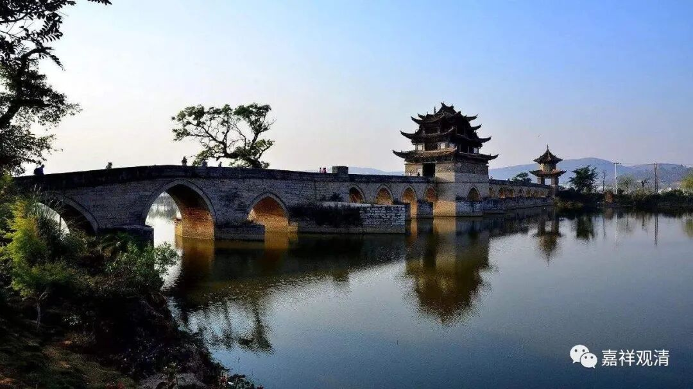

《**微课堂佛教史》264·1**

好，我们继续讲药山惟俨禅师。

药山惟俨禅师是石头希迁禅师门下的，我们前面讲过了，其实他跟马祖道一禅师也学习过。好像马祖道一禅师和石头希迁禅师他们的弟子，也比较明显地分为江西派和湖南派。石头希迁禅师门下包括药山惟俨禅师这一支，明显比较多的是在湖南活动。而马祖道一禅师的门下，我们前面也讲过了，好像都是围绕着江西，或者都是和江西有点关系。

这个现象在印度佛教当中也出现的，很多佛教的宗派（的成立与展开）都是和地域有关。比如说大众部的东山住部、南山住部、北山住部、西山住部……都是和地域有关，再比如支提山部等等，这些名称都是和这个宗派的所在地有关。

那么在中国呢，不同的地方，它的禅风也不一样。我记得有人专门进行过这样的统计和研究，好像是写了论文还是书。说，不同的禅师，比如说德山棒和临济喝，他们的禅风就和两位祖师的地域、出身有关系。如果你是在江南的禅宗，就会和三论宗一样，比较具有江南的味道——玄风比较盛。

最近讲药山惟俨禅师，讲了一半，我们现在再讲一些其他的事情吧。之前讲过，虽然有公案说药山惟俨禅师让大家不要去多看书，其实他自己倒是多看书的。所以那个所谓的“不看书”，可能只是他的一些针对性所讲，但是却被后人发挥得过多了。

我们举个例子来说，韩愈的弟子——李翱，就是写《复性书》的那位，在儒家或者是宋明理学当中——其实也不是宋明理学，是唐代开始的诸家，他算是比较重要的一位人物。李翱官也当得不小，最后当到了山南东道的节度使。我们待会再讲讲李翱这个人吧。

回到药山惟俨禅师，我们再讲一个他的公案。

有人问药山禅师：“如何是道中至宝？”修行当中最重要的是什么？我觉得这个讲得很好，所以要拿出来讲一讲。

药山禅师：“莫谄曲。”这个大家自己想一想，“莫谄曲”应该怎么理解。

然后别人又问：“不谄曲时如何？”不谄曲的时候，是怎么样的呢？

药山禅师：“倾国莫换。”

这个其实和六祖大师讲过的几句话意思很像，其实他的意思就是：做人要老实，不要骗自己，骗自己是没有意思的。在修行的时候，骗自己、骗别人是最没有意思的，你骗得了整个世界，其实你骗不了自己，但是通常我们真的会骗自己、骗别人啊。

我的理解，这里的“莫谄曲”并不是说心要“直”，有什么东西都要说出来，不是这个意思。它的意思是不要去骗，不要骗别人，不要骗自己，该是什么，就是什么。

我们有很多问题都发生在这一点上，包括我们有些兄弟也是这样，人到中年了就开始觉得自己有点了不起了，快要做大师了……唉，这么多年，一个个的“大师”都冒出来了，没想到兄弟当中也……希望他最后不要真的变成“大师”了。有些“大师”，真的是没必要啊！

“莫谄曲”，我的理解就是要老老实实，认认真真，该是什么，就是什么。如果真的做到了的话，那是“倾国莫换”，如果碰到这样的人，实在是太难得了！我现在平时接触很多人，真的是碰到这种“莫谄曲”的情况是极其少见的。一般人总是比较喜欢“装”，还是那个词——“装”，自己有三分的，最好能夸大到八分，甚至夸大到十分。

大家都“莫谄曲”ho！

