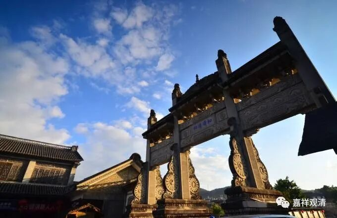

**《微课佛教史》265·2**

药山惟俨禅师还有一个公案也比较有名的。

有人问药山惟俨禅师：“兀兀地思量什么？”

药山禅师：“思量个不思量底。”

问：“不思量底如何思量？”

药山禅师云：“非思量。”

这个对话呢，我们当然可以从经教的角度来理解。“思量个不思量底”，我们也可以把它理解为：现在是未证果的境界，最后要达到的是证果的或者证空的无分别的境界……

类似的问题我也问过我师父（我们的对话就不在这里说了……）。

这两个就是药山惟俨禅师比较重要的公案。

现在来讲一讲前面提到的李翱（一半是羽毛的羽，一半是牛皋的皋，就是翱翔的翱，不是现在的那个李敖）。李翱那个时候在做朗州的刺史（朗州可能就是现在的常德），所以接下去的几个人都和这个地方有关。后来的龙潭崇信禅师（他也是药山惟俨禅师的弟子）也在朗州，也和李翱有点关系。再后来龙潭崇信禅师的弟子德山宣鉴禅师，住在哪里呢？住在德山，而德山就是在常德边上。德山宣鉴禅师的德山，就在常德边上。所以他们那一系基本上还是在朗州这个地方，没动过。而药山惟俨禅师的药山，在《宋高僧传》当中说，药山又叫朗州药山，还是说他在朗州。那么它到底是不是朗州呢？反正很近。

刚才讲德山宣鉴禅师的德山就在常德的边上，我上次去常德的时候没去，下次如果有机会的话再去看看。中国抗日战争的时候有一场常德会战，在德山这里还打了两次，还是一个比较重要的地方。抗日战争当中好几个地方打过大仗，都是比较重要的。还有那个雪峰山会战，好像都是和74军有关。雪峰山会战74军打过，常德会战74军（后来有段时间叫整编74师）也打过，都是在这个地方。

