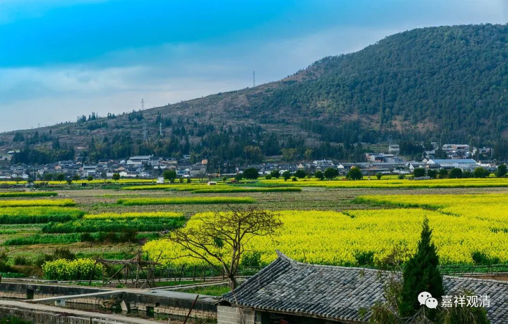

**《微课佛教史》265·2**

在李翱向药山禅师问学的时候，禅宗里面的记载就直接是问答了。但是按照道理来说，应该是宾主落座，然后再如何如何，再问“如何是道”。这个问题也确实属于李翱一直“念兹在兹”的东西，是他的生命的问题，这和他后面写《复性书》都有点关系。于是他问：“如何是道？”

什么是道？是一个关于形而上的问题——形而上谓之道。（中国文人骨子里还是喜欢道家或者玄学的这些东西。）李翱这是在问药山惟俨禅师，而药山禅师又是读过书的人，他是完全可以有现成答案回应的（就像之前的“贵耳而贱目”）。比如《庄子》里面早就讲了：“道在屎尿中。”所以，李翱等于是又把答案送给药山禅师了。

药山禅师是读过书的，但他没有回答这句“道在屎尿中”，因为这是《庄子》里面讲的，直接捡一个《庄子》里面的答案，李翱肯定不满意。公案里面讲药山惟俨禅师说的是什么呢？“云在青天水在瓶。”

我们现在看起来，这句话应该是后来总结的，应该是在给他讲解什么是道的时候说的，“云在青天水在瓶”。那么，“道在屎尿中”，“云在青天水在瓶”，都是水。在天上就变成云，在瓶里面就是水，作用和特征似乎不同，内在的本质是一样的，所以叫“云在青天水在瓶”。它的意思和“道在屎尿中”一样，或者说至少我认为可以这么理解。

那么，所谓的（最终版的）“云在青天水在瓶”这句话，应该是后人整理的，它出自李翱后来写的一首诗：

“练得身形似鹤形，

千株松下两函经。

我来问道无余说，

云在青天水在瓶。”

因为有了李翱的这首诗，所以后来公案里面就把它简化成“云在青天水在瓶”这句话了，就直接把李翱这个文字放进去了。

我们也可以看得出来，药山惟俨禅师之所以被李翱所推崇，或者说最终拿下李翱，让他成为禅宗的一个大护法，很重要的一点是因为药山禅师的学识。所以你们千万不要认为药山禅师是没有文化的，或者认为他劝大家不要去学习的……他绝对不是这个意思。

李翱后面写的《复性书》和宋明理学也特别有关系，它里面有一段：“人之昏也久矣，将复其性者，必有渐也，敢问其方。”怎么去复性呢？“曰：弗虑弗思，情则不生，情既不生，乃为正思。正思者，无虑无思也。”这不就是禅宗的“无念为本”吗？“弗虑弗思”不就是“无念无住”吗？这不就是前面药山禅师讲的那个“思量个不思量底”吗？所以，李翱在药山惟俨禅师门下肯定是学习了不少的内容，也有一些禅修方面的修养。

我们前面也讲过了，李翱后来也帮忙了龙潭崇信禅师，或者说推出了龙潭崇信禅师。再后来德山宣鉴禅师在德山常德待下来，和李翱应该也有点关系。后人也经常说，陆王之学的主体或者来源都是出自李翱的《复性书》，可能都有点关系吧。

好，今天药山惟俨禅师先讲到这里，谢谢大家！

