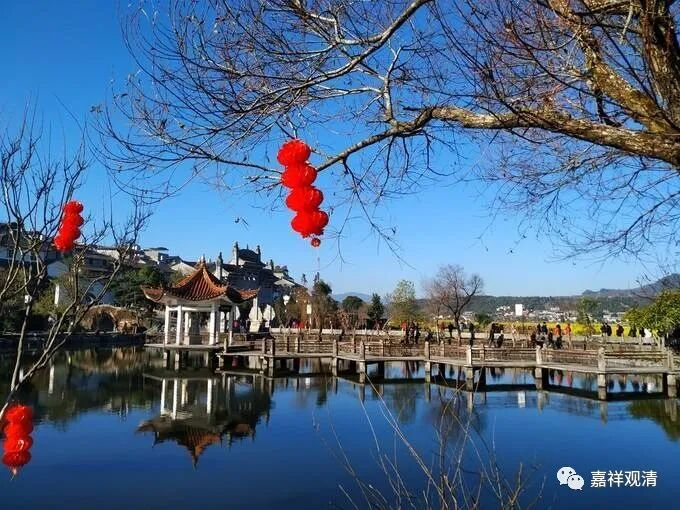

**《微课佛教史》268·2**

特别是今天才挖出来的一些碑，我们就应该注意一下辨伪这个方面。上次有几个兄弟让我帮忙看看他们看的古籍，我个人判断是不是真的。辨伪是有方法的，看字体当然其中的一种方法，还有就是看里面的字是不是都一样。比如读过一块碑，它里面的很多字，比如“之”字，（写法）全部都是一模一样的——所以，这是不是现在电脑重刻出来的呢？所以这就是一种辨伪的方法。比如说写本里面有“耳识”两个字，所有地方的“耳识”都写得一模一样，甚至比如说都和我们电脑里面的魏碑体写得一模一样……那就都是问题。

所以我们在接触古代文献的时候，一定要注意辨伪。还有一个问题就是：如果辨伪水平不高呢，奉劝你就别碰。这两天不断地有人要找我来谈谈辨伪这个问题，其实我真心不太愿意和大家专门谈这个话题。因为辨伪并不是一个很简单的话题，对你讲了半天，你又不信，那你何必来找我呢？没有意义啊。如果你对我不存在信心的话，你何必来问我呢？既不讲理，又没信心，纯粹白问，是吧？

再说天皇道悟禅师，其实在记载当中他的事迹并不那么多，反而记载比较多的是从宋代开始一直到清代的对天皇道悟和天王道悟的辩论。说实话，这种辩论也没有太大的意义。即使我们真的承认这就是两个人，那又怎么样呢？后来传承下来的还是云门宗和法眼宗。现在更多的人应该是支持只有一个人——天皇道悟禅师，就这一个人。他门下重要的弟子就是龙潭崇信禅师。

关于龙潭崇信禅师和天皇道悟禅师，也有一个很重要的公案。就是龙潭崇信禅师出家前是一个卖饼子的（说实话，实际情况是不是这样啊），说他每天在天皇寺的隔壁给老和尚十个饼，老和尚每次都还给他一个饼。后来时间长了，龙潭崇信禅师就去问老和尚：“你这是什么意思？”天皇道悟禅师回答说：“你给我十个，我给你一个，这有问题吗？”然后说龙潭崇信禅师就这样出家了。我也觉得这个公案有点莫名其妙，而且这个故事又把龙潭崇信禅师变成了没文化的人，说他是卖饼子的，是吧？

我还是要重申一下，对于早期的禅师来说，他们都是要结交士大夫阶层的，一般来说都应该具备相当的文化水平才行。特别像龙潭崇信禅师、天皇道悟禅师等等，他们都和裴休、李翱这样的人物有点关系，如果没有一点士大夫能够接受的文化水平，应该是不行的。

当然，我现在也没有什么实锤，但是我更倾向于这些早期的禅师都是文化之士。你们可以想象一下，当年这些寺院的住持，如果你不具备一定的和士大夫交往的能力，仅仅是一个卖饼子出身，成年以后再出家的，最后还成为大师——这种可能性真的是太小了。

后来龙潭崇信禅师又有一个比较重要的公案，说他待的时间长了以后，就向师父告辞：“师父，我要走。”

师父问：“你为什么要走？”

他说：“我来了这么长的时间，你也没有教我什么。”（我觉得这个故事应该是真的，应该是有了这个故事以后，才有前面的故事。）

天皇道悟禅师就说了：“你每天打个手巾过来，我就接过来。你把饭端上来，我就吃……你做的所有的事情，我都有回应。我时时刻刻在给你指示，在讲法，在教导，你怎么没看到呢？”

然后说龙潭崇信禅师突然就开悟了（按照禅宗经典里面的讲法，我觉得实际上应该是明白了），于是龙潭崇信禅师就留下来继续学习。

我觉得这是师父和徒弟之间的正常对话。为什么呢？就是徒弟觉得待在师父这里，好像没有给自己专门讲什么，但师父确实是时时地给予各种磨炼或者指示，这些教导都有，只是弟子没把这些当回事，没当作是对自己的锻炼。等到师父明确指点了以后，他才知道：哦，原来这都是在指点自己，在锻炼自己。我觉得这可能是龙潭崇信禅师在天皇道悟禅师门下的一个真实事件。

接下来就是龙潭崇信禅师开法，他开法了以后呢，就遇到德山宣鉴禅师。这个故事等明天再讲了。前面我们也提到“临济喝、德山棒”，那么明天“德山棒”就要出来了。

好，今天先到这里，谢谢大家！

