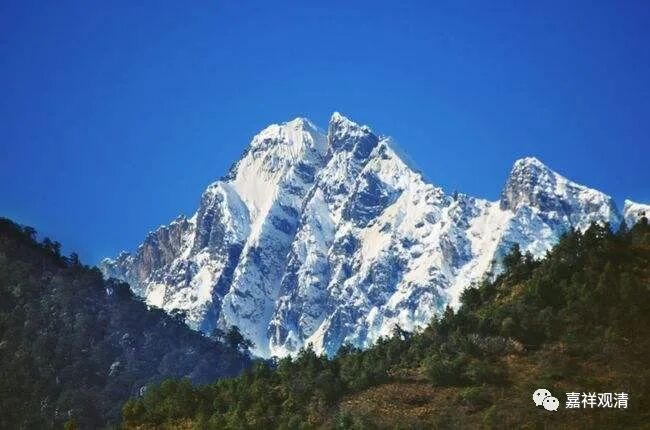

**《微课佛教史》269·2**

德山宣鉴禅师后来就饿着肚子上山了，还趾高气昂的，因为他本来是以《金刚经青龙疏钞》作者的身份，准备来破南方的魔子魔孙的。

见到龙潭崇信禅师之后，就讲了几句话（又是那种“闻名不如见面”的话）：“久向龙潭，及乎到来，潭又不见，龙又不现。”我在外面听说龙潭寺非常有名，但是我到了这里呢，发现“潭又不见，龙又不现”。（没见大师来了吗？魔子魔孙在哪儿呢？！）

“龙潭”的潭，就是小湖的意思。“潭又不见，龙又不现”，没看到“龙”，也没看到“潭”！龙潭呢？这句话也是双关语。实际上德山宣鉴禅师想说的是：“我没觉得你有多了不起，水平也不怎么样嘛。”没看到，就是“龙又不现”。

龙潭崇信禅师就说了：“子亲到龙潭。”那你到这个地方了，我承认你到了龙潭。我觉得这里面还有一层含义就是：你都到了这个地方，你还不知道吗？前面德山宣鉴禅师说“潭又不见，龙又不现”，意思是“我没看到”，他本来是想损对方的。结果对方说：“你自己不知道你已经到了吗？”

这是一个双关语，这里有地名的问题。“子亲到龙潭”，你已经到龙潭寺了，你都到了，你自己还不知道吗？

德山宣鉴禅师估计也听懂了这个双关语了，知道自己第一招就败了。既然败了，那就住下来了。住下来以后的事情，我们明天再讲。

** （《五灯会元》：**

** （德山宣鉴禅师）遂往龙潭。**

** 至法堂，曰：“久向龙潭，及乎到来，潭又不见，龙又不现。”**

** 潭引身曰：“子亲到龙潭。”**

** 师无语。遂栖止焉。）**

先到这里，谢谢大家！

