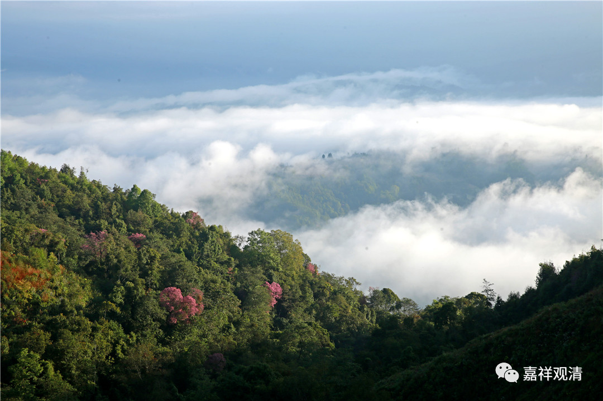

**《微课堂佛教史》270·1**

好，我们继续讲德山宣鉴禅师。

德山宣鉴禅师在龙潭崇信禅师那里就住下来，说这一住就住了三十年。他之前是学习过很多经典的，而且还著作了《青龙疏钞》。关于他的开悟因缘，就说有下面这个故事。

一个晚上．他在龙潭崇信禅师房间里，正准备出门，龙潭崇信禅师说：“那你回吧。”他掀开帘子就出去了。出到外面一看——太黑了，就返回房间，说：“外面太黑。”龙潭崇信禅师就给他点了一个纸灯笼，点完以后德山宣鉴禅师刚刚接过来，龙潭崇信禅师就给吹灭了。

传记里面说德山宣鉴禅师当时就开悟了，然后跪下来礼拜。龙潭崇信禅师就问他：“你礼拜什么呀？你刚才得到什么东西没有？”德山宣鉴禅师就说：“从此以后，我再也不疑天下老和尚的舌头了。”（一个书生真的服了老禅师。）

这是什么意思呢？我们放到后面再看吧。当然，大家各有各的理解，我个人觉得我也有我自己的理解。不过，他是不是靠“理解”而开悟的，要另外再说了。到时候我就给大家讲讲我的理解吧。

后来德山宣鉴禅师比较出名的一点就是他“呵佛骂祖”，禅宗“呵佛骂祖”的风气差不多是从他开始的。外人看到的可能就是“呵佛骂祖”，而我看到的却是另外的一面。

我们先来看看德山宣鉴禅师讲过哪些话，其实我觉得从某些角度来说，这些话确实是蛮正确的。比如说这一段：

“诸子，”兄弟们，或者说和尚们，“老汉此间，无一法与你诸子，作解会，”老汉这里没有什么东西给你们这些人“作解会”。我觉得这个“解会”很重要，意思就是没有什么东西需要你们去特别理解的，帮你们作注解的。“自己亦不会禅。”禅呢，我也不懂。“老汉亦不是善知识，百无所解，”我啥都不懂。“只是个屙屎送尿，乞食乞衣，更有甚么事？”我就是一个老和尚。“德山老汉劝你：不如无事去，早休歇去！”

这是什么意思呢？我的理解：就像后世禅宗里面所讲的，不要去谈其他（不属于你）的东西，把你自己禅修的内容照顾好。很多人把这些话上纲上线，搞得禅师们都像是制迷高手，呵呵，你们想多了，“莫作解会”，老实点不行吗。

（我的经验，大家关心的都不是自己的“问题”，连“问题”都是抄来的——人生有什么意义、都去出家了世界怎么办……我现在听到这些貌似高深却千篇一律的“问题”都有点上头。偶尔听到一个“好问题”很兴奋的……

在这些“假问题”以外，其他就是三个“问卦”类的：1、工作；2、孩子；3、健康，极少有4、父母……）

