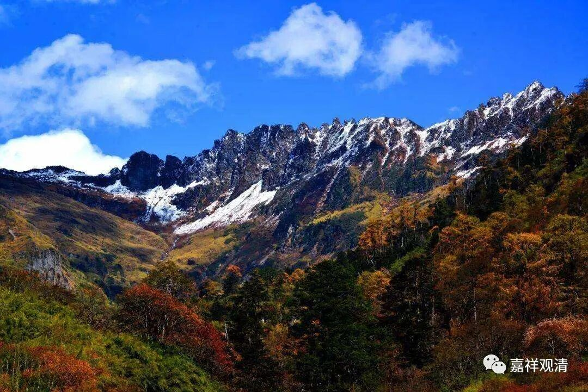

**《微课佛教史》272·2**

法藏法师的弟子的实力也非常强大，今天的眼光看，其中最重要的弟子应该是慧苑法师吧，著有《慧苑音义》（也就是《新译大方广佛华严经音义》）。慧苑法师的梵文也非常好，不过他就因此对他师父的一些说法不太满意，说：“你这种说法都是自己想出来的，没有什么依据。”“这个还不如天台……”所以对他师父就有些批评。

法藏法师算是华严宗的第三代，本来说起来慧苑法师就应该是第四代。但是由于慧苑法师是反对他师父的，就被大家批评——居然敢反师父，后来就被“华严宗”内部除名了。其实单单就实力而言，慧苑法师未必逊于法藏法师，他的梵文也很好，中国古典的小学也很好。

法藏法师为新译的《八十华严》做了注疏，慧苑进一步完善，并对法藏大师的宗说做了不少抉择与批评——这在后来的华严系统被认为是大逆不道，所以他的著作极少传世。从有限的传世作品里来看，慧苑法师作为一代宗师在华严宗系统里面，其整体实力即使不进前三也能排进前五，胆子大一点来说，排前三绝对没有问题。

但和慧苑法师同时代的，法藏法师的门下好像也没教出什么特别的弟子，至少没什么特别有名的人物。

再后来呢，华严一系出现了一位天花板级的人物，就是清凉澄观法师。

清凉澄观大师非常长寿，而且早期的时候在江南等等各地游学，唯识也学了，中观好像是在苏州学的，天台也学了，后来又学了华严，就专治华严了，并且来到了五台山（又称“清凉山”），所以被称为清凉澄观。

澄观大师来到五台山之后，著作了《华严经》的注解，先是撰写了《华严经疏》，对《华严经》进行注解，后来又撰写了《随疏演义钞》，就是对《华严经疏》再进行注解。后人录疏配经，更会钞入疏，称为《华严经疏钞》，这部作品的篇幅相当庞大。

因为清凉澄观法师是反对慧苑法师的，所以后来就把他称为华严宗第四祖（法藏大师算第三代）。所以，华严宗的第三祖和第四祖之间是没有直接的师承关系的。（这一点我们稍微脑子里记一下，以后我们会提到关于中国人认为的宗派传承问题……）

