**《清明上河图》里两处佛教细节**

《清明上河图》现存有很多版本，有原件、有摹本……张择端版和仇英版是其中最著名的两版了。我们来看辽博的仇英·《清明上河图》里面的两处和佛教有关的细节——

（一）

第一段——

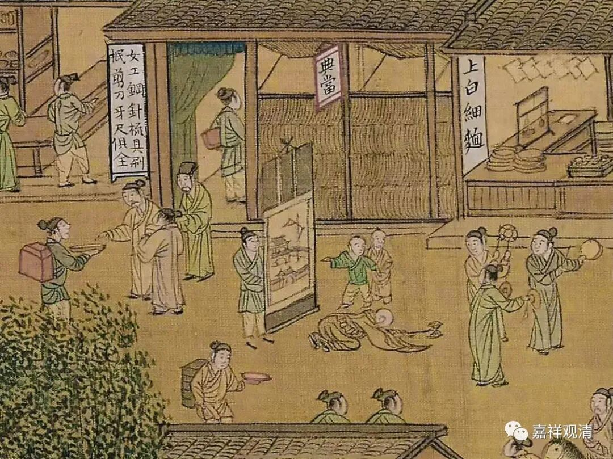

画面的中心是一个匍匐（礼拜中）的僧人。僧人的左手似乎是个法器，像是香炉——手炉。

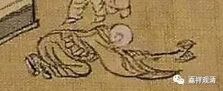

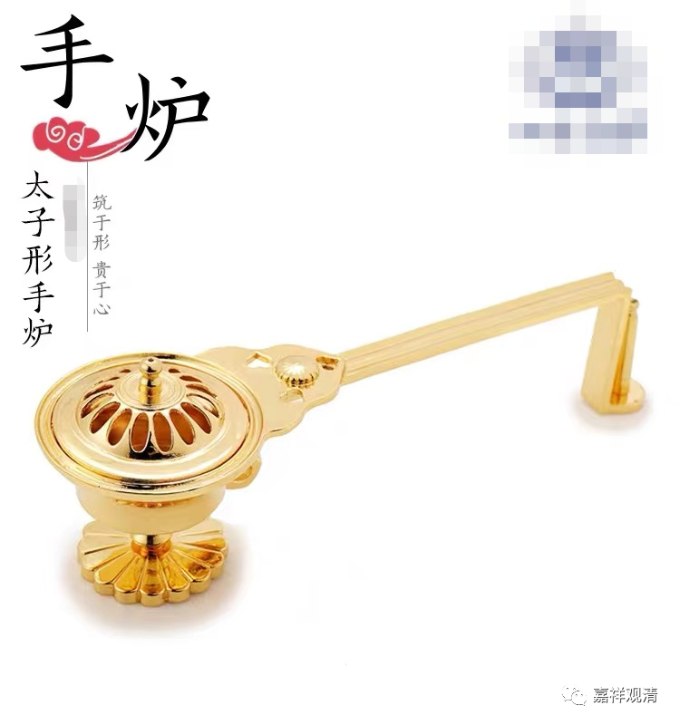

这种手炉，里面燃香粉，宋代已有，沿用至今。古画中也常见。我们找到一些复制的古画——

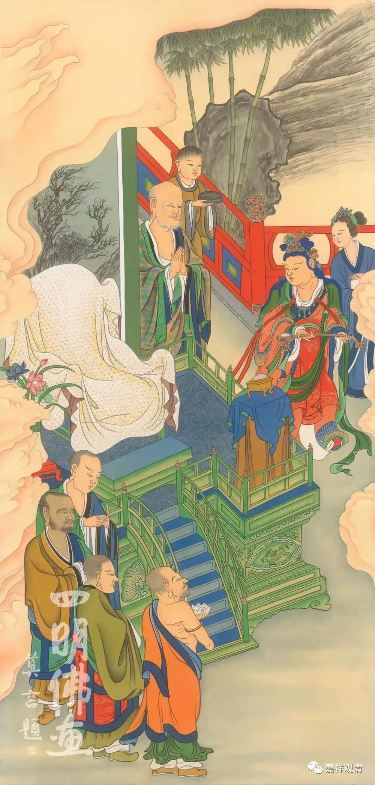

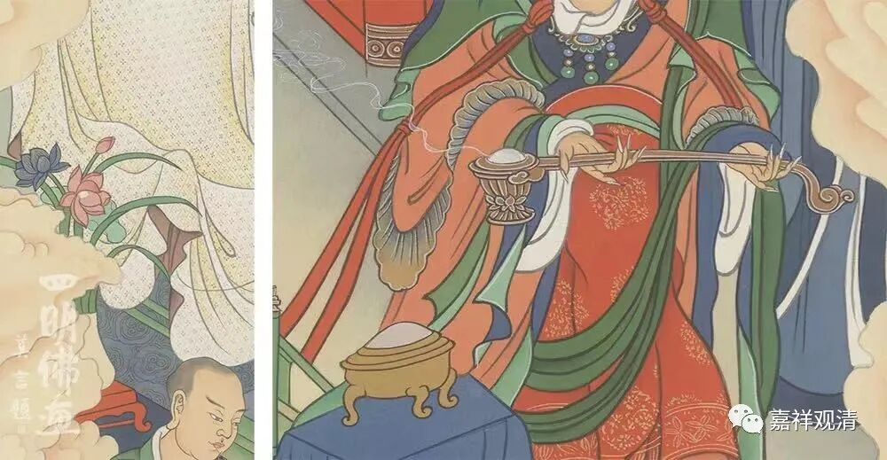

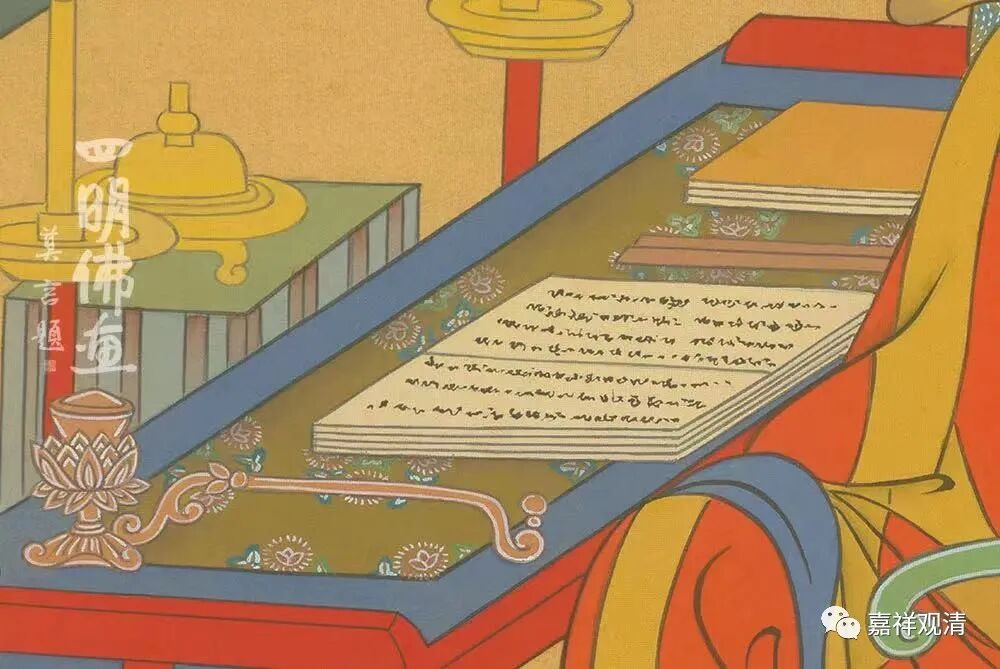

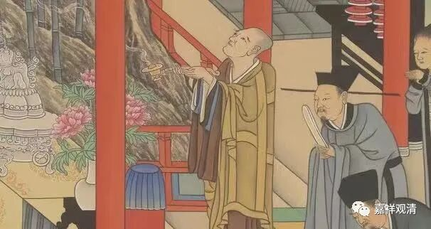

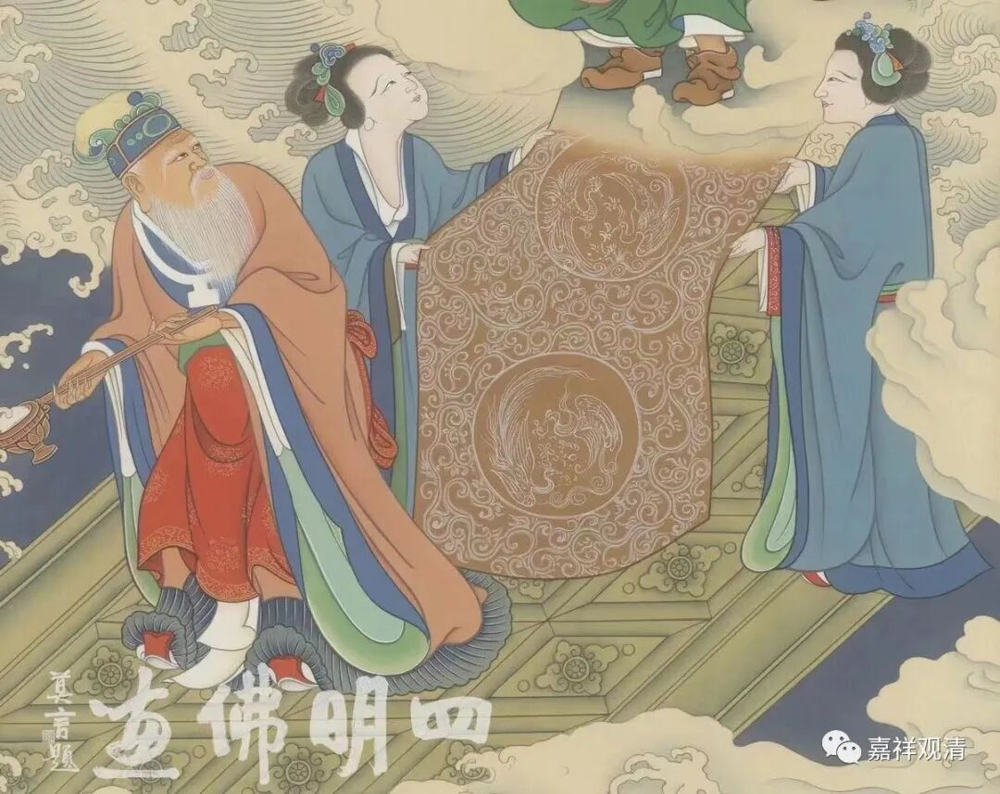

前排有三个人（居士），明显不是出家人，手里拿的是“法器”（乐器）：正面第一人手里拿的是鼓，第二人拿的是铛，背对画面的第三人手里拿的是铪子（铜锣）。

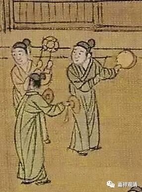

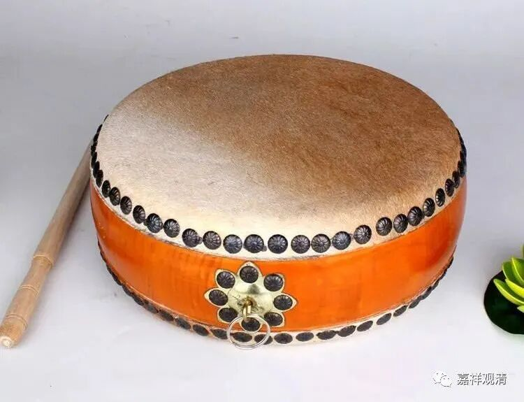

** 铛**

 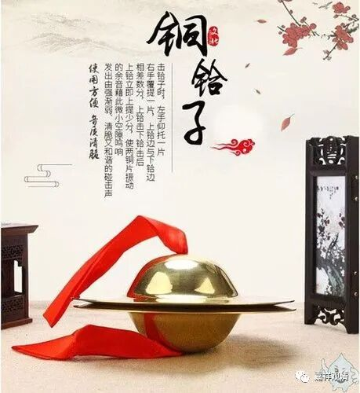

 ** 铪**

（成套的法器里，似乎还缺一个引磬，一个木鱼。不念经不用木鱼，那么，引磬呢？我怀疑过僧人手里会不会是引磬，但还是更像手炉，意思也对得上。）

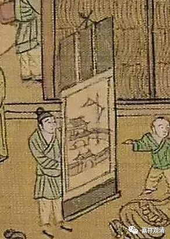

僧人之后也是一俗家弟子（居士），手里提举着一幅画，像寺院图。

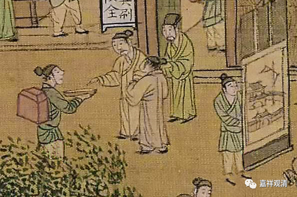

最后一俗家弟子（居士）手里托着盘，背后背着箱子，有路人（施主）在捐款。

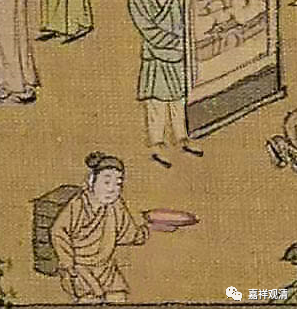

提画者的下方也有一人托着盘子背着箱子，这人可能也和图样最右边的那个人一样，是化缘收钱的居士。

这一段《清明上河图》的细节，不仅仅是单纯的展示“化缘”。和尚磕头类似一步一拜去四大名山，大家看着“哇，苦行”，后面提着寺院图，也许表示“我不是为自己要钱，我们要建庙”，也可能画的是类似敦煌的“五台山朝圣图”。

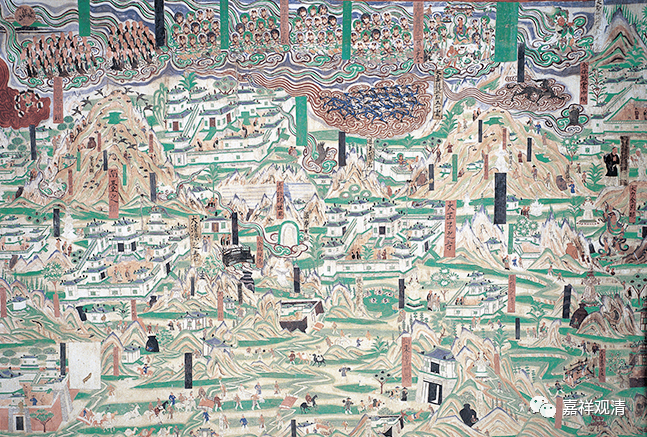

** 敦煌61窟《五台山全图》**

同时团队合作也表示了这一点。这么看来确实是为了建寺院或者什么大事，组织了团队，方法是僧人苦行礼拜（类似一路磕头朝山）引起路人注意……

** （二）**

再来看仇英版《清明上河图》这第二处细节——

画面中间是僧侣二人，前者略年长，托钵，有施主像是在布施。后面那位略年轻，顶着七级佛塔。这里也有表“苦行”的意思，顶个塔可不太轻松（有的地方降神也要顶个很重的大帽子）……目的未必是要建那个塔。

我们再看看其他版本。

（三）

这是纽约大都会收藏的仇英《清明上河图》，内容与之前大致相仿，僧人着了袈裟，手中的东西像手炉，却更像如意。前面三个居士手里的法器，鼓和铪子都不错，但持铛子的变了，手里的东西完全不成形。

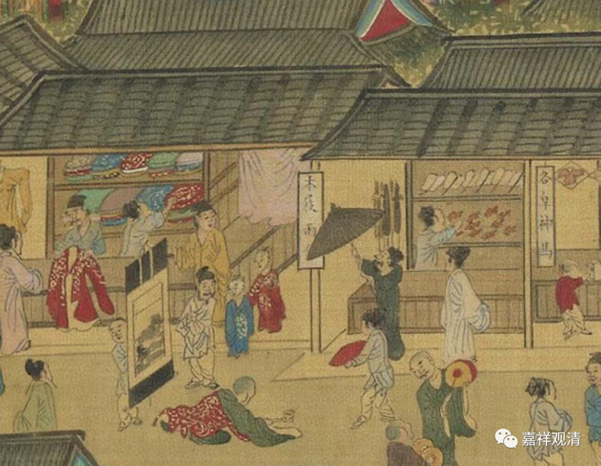

再看这一版，台北故宫藏仇英·《清明上河图》。图中中央僧人着袈裟持手炉不变，前后几位执法器、举挂画的都是僧人。队伍前面两位僧人手里有鼓和铪子，没有持铛子的人。

这里可以分析出，纽约、台北的《清明上河图》都不是真迹，应是仇英《清明上河图》之摹本，他们没有读出“铛子”这个佛门法器，所以或者画错，或者直接省略了。

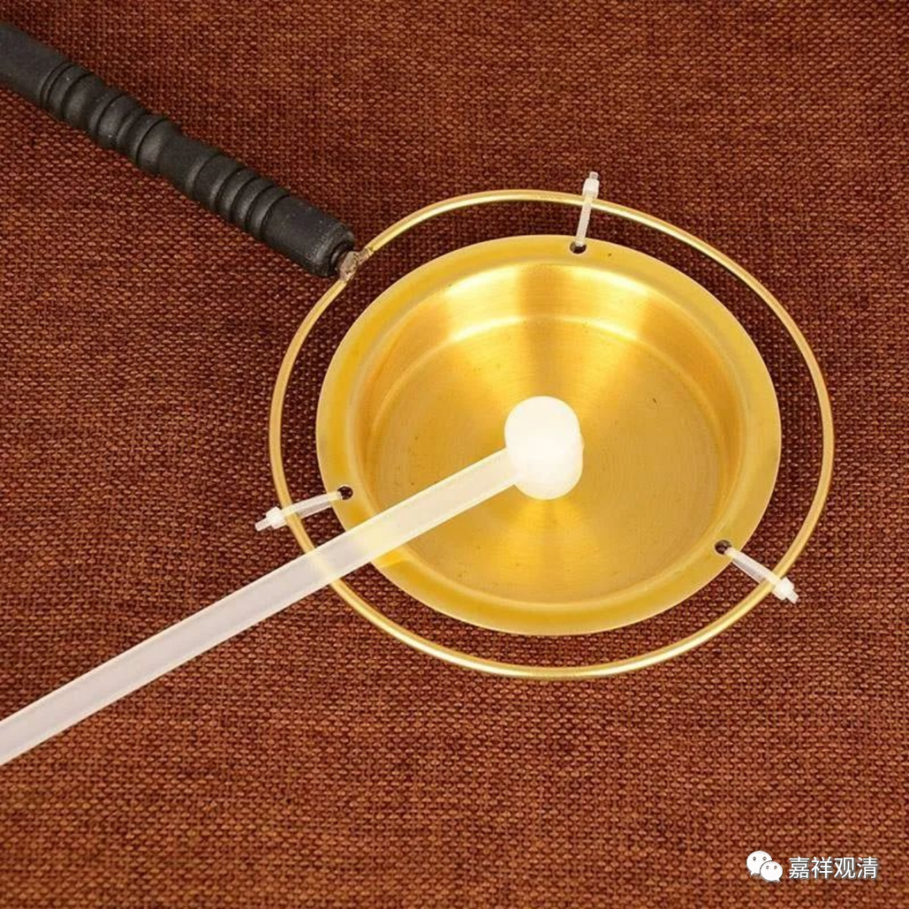

这是台北故宫版"顶塔"的——

我们再找找上面《清明上河图》，看看还有啥聊的……

        修改于