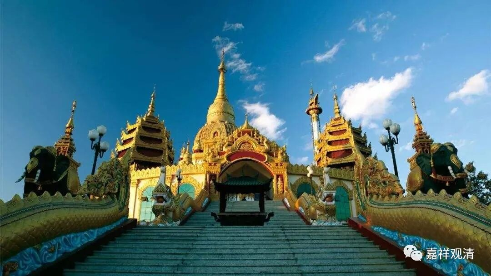

**《微课佛教史》276·2**

第一个：** “谓带异计，欣上厌下而修者，是外道禅。”**第一个是外道禅，怎么说呢？是带着其他的“异计”，就是这种禅法是要再加上一种其他宗派的观点——错误的、非佛教的哲学观点，也就是外道的认识，然后“欣上厌下”——这个修的就是四禅八定。按照这种方式去修禅，同时他所持的是外道的观点，这种就是“外道禅”了。

然后，** “正信因果，亦以欣厌而修者，是凡夫禅。”**这句话讲起来应该是要加字的：“正信因果，亦以欣厌而修者，是内道的凡夫禅。”因为他已经信因果了，是吧？“亦以欣厌而修者”，这也是修四禅八定的，是不会成圣的，所以称为叫“凡夫禅”，这是第二个。

第三个，** “悟我空偏真之理而修者，是小乘禅。”**这个是什么呢？说他的观点仅仅通达人无我而不通达法无我，这一点我们在宗义里面讲过了，是吧？所以这类人对真实的理解是偏的，叫“偏真”。以“悟我空偏真之理而修”的，这就是小乘禅，你可以理解为小乘的禅修。

** “悟我法二空所显真理而修者，是大乘禅。”**这句话可能需要我来帮他解释一下。如果单纯从文字来看，“悟我法二空所显真理而修”，这样顺下来看，是唯识的，“悟我法二空所显真理”，对吧？如果要把中观也放进去，就是“悟我法二空”，而这个“我法二空”，就是“所显真理”或者真如，如果这样讲的话，就是中观也适用。那么，这个“悟我法二空所显真理而修者”，就可以说是大乘禅。但从本身的文字看起来，他的理解应该是接近唯识系的。

** “上四类，皆有四色四空之异也。”**修上面这四种禅法，“四色四空”都可以有。这个“皆有”的“皆”，并不是说全都必须有，是可以有。因为内道的小乘禅和大乘禅都未必要修“四色四空”，但是可以修“四色四空”。比如说，在初禅未到地定修的话，也是可以的。这句话的意思就是，可以修“四色四空”。

禅呢，本来是指“四色”，就是色界的四禅，对吧？初、二、三、四禅。“四空”呢，就是空无边处、识无边处、无所有处、非想非非想处。所以，四个属于色界的，四个属于无色界的，就叫“四色四空”。这个“空”可不是“自性空”的那个“空”。“四色四空”就是四禅八定。

其实单纯来讲的话，“禅（那）”的范围是小的，其实就在四禅——一、二、三、四禅，就是等于“四色”。但是在这里圭峰宗密禅师把禅的范围扩大了，把无色界的定，也就是四禅八定的定，也算进去了，所以就包括了四空定。

上面四个就是达摩禅对“禅（定）”的（粗放的）总结。

