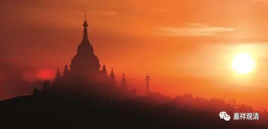

**《微课佛教史》279·2**

其中江西（道一）、荷泽（神会）、北秀、南侁、石头（希迁）、保唐、宣什，这些都是达摩禅门下的，他们之间虽然有差别，但都算是达摩禅分出来的。

荷泽神会禅师是出自六祖大师门下，江西的马祖道一禅师也是出自六祖大师门下青原行思，还有石头希迁禅师出自六祖门下南岳怀让，这样从六祖大师门下直接、间接出来的就有三个系统。

北秀和南侁，都是五祖门下的，僧那禅师是二祖门下旁出的，所以僧那也算是达摩系的禅师。保唐是南侁这一系出的，所以也是达摩禅。

宣什，具体的创立者是谁不清楚，但是也在四川，宣什是他们的寺院名称，是属于念佛禅的。圭峰宗密禅师在他的另外一本书《圆觉经》的注疏当中，提到过宣什宗的很多方式、仪轨等等和保唐宗都很像，都是在四川的。

所以上面这些基本上都是属于达摩禅门下的。

这十一家当中，也有不是达摩禅门下的，比如说牛头系。当然，后来也有人说他是四祖门下旁出的，但牛头系实际上是三论系的禅师，算是三论系的正宗禅师，并不是达摩禅这一系的，性质是不一样的。（后期达摩禅系一统江湖，“历史”就变成“四祖道信收购牛头禅”了，其实即便有交集，最多也只算交流，不算旁出。）

僧稠禅师也不是达摩禅这一系的，僧稠和达摩禅在当时是平行的，在南北朝时期僧稠禅师的声望和名气甚至可能更大一些。我们刚才也讲了，敦煌的文献里面好像有几本僧稠禅师的作品。

天台也是和中观禅有点关系，但等于另外又立了一宗。天台是中国化佛教的代表，我的意思懂吧……

在这十一家当中呢，僧稠的禅法比较接近印度的传统（声闻）禅法；牛头的禅法实际上是中观禅正脉；天台的禅法和中观禅有点关系但别出心裁，和僧稠的禅法也不无关联，但和达摩禅不是一个系统。僧稠、牛头、天台这三家明确地都不属于达摩禅系统。

总结一下：圭峰宗密谈的这十一家当中，有八家是达摩禅系统，而有三家并非达摩禅系统。

好，今天就先讲到这里，谢谢大家！

