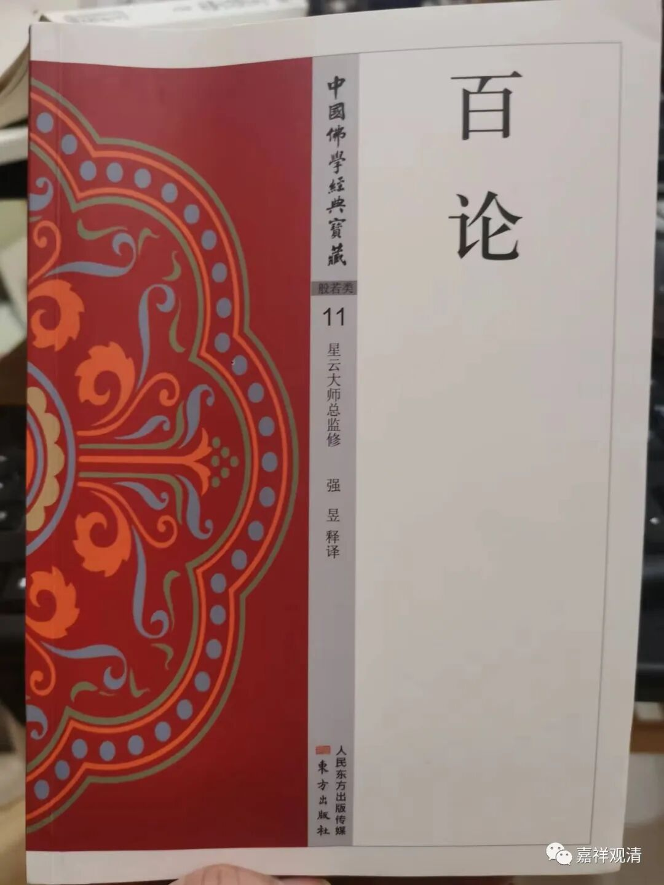

**白话《百论》，烧了吧**

实在忍不住，就再最后骂一回。

（一）

《百论》：

***“外曰：佛說何等善法相？”***

这句话的意思是：“外道问：佛说了哪些善法？”

白话者去查了下佛教词典，然后在自己脑子里转了两卷，给“法相”输出了一个注（P26）：** “法相：有两种含义，一是泛指事物的性质、形状、名词、概念及其含义等等。一指真如、实相。此处指后者。”**

不具体追究这个注解里太多的错误了，这个“此处指后者”，是把《百论》这里的“法相”解读为空性，明确暴露了作者对佛教的无知。而且，这里的“善法相”是“善法之相”而不是“善与法相（法性）”，直接翻译为“善法”就好。而白话作者的翻译则把“善法相”拆成“善”与“法相”（P27）：

** “佛宣谕的使人得益（善）的对世界本质的认识（法相），是怎样的呢？”**（括号里的字是我加的）

后面提婆回答外道的是“恶止善行”，怎么也搭不上“对世界本质的认识”啊！

（二）

《百论》：

***“复次，自他共不可得故。”***

《百论》论主的意思是：“另外，因为自生、他生、共生不可得……”“自他共”是指“自生”、“他生”、“共生”，这在中观是最常见的用法了，如著名的《中论·观因缘品》里的这一颂：

***“诸法不自生，亦不从他生，***

***不共不无因，是故知无生。”***

*** ***

而白话《百论》（P31）的作者是这么作妖的——“** 一切生成的东西有三种要素，自、他、共”**……真是“瞎掰”的最佳例证。

可以确定，白话《百论》的作者认识中国字（这一点我很难否认），但他对佛教是** 完！全！不！懂！**啊！

