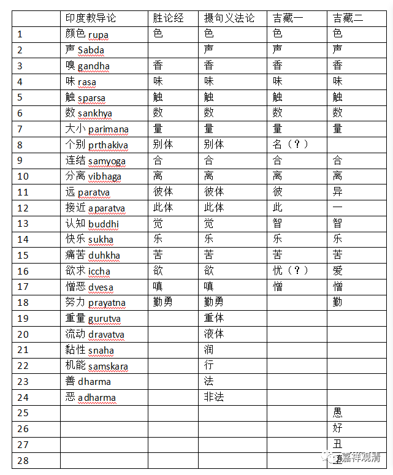

现在我把摩诃提瓦的《印度教导论》、姚卫群的《印度宗教哲学概论》、《古印度流派哲学经典》和吉藏的《百论疏》《中论疏》提到的胜论“德”句义做一个简单的比较。

先做一个表格：

印度教导论

胜论经

摄句义法论

吉藏一

吉藏二

1

颜色rupa

色

色

色

色

2

声Sabda

声

声

声

3

嗅gandha

香

香

香

香

4

味rasa

味

味

味

味

5

触sparsa

触

触

触

触

6

数sankhya

数

数

数

数

7

大小parimana

量

量

量

量

8

个别prthakiva

别体

别体

名（？）

9

连结samyoga

合

合

合

合

10

分离vibhaga

离

离

离

离

11

远paratva

彼体

彼体

彼

异

12

接近aparatva

此体

此体

此

一

13

认知buddhi

觉

觉

智

智

14

快乐sukha

乐

乐

乐

乐

15

痛苦duhkha

苦

苦

苦

苦

16

欲求iccha

欲

欲

忧（？）

爱

17

憎恶dvesa

嗔

嗔

憎

憎

18

努力prayatna

勤勇

勤勇

勤

19

重量gurutva

重体

20

流动dravatva

液体

21

黏性snaha

润

22

机能samskara

行

23

善dharma

法

24

恶adharma

非法

25

愚

26

好

27

丑

28

堕

我们对比可以看到：

1、《印度教导论》和《摄句义法论》的“二十四种说”是完全一致的，这是后期的通说；

2、《胜论经》与吉藏的“十七种说”，吉藏多一“声”而少“勤勇”（这有可能是吉藏记忆错误吗？胜论的“声”比起“色、香、味、触”要略输半筹——当然后期的二十四种说里地位一致了。）；

3、《摄句义法论》的“二十四种说”和吉藏的“二十一种说”相较于《胜论经》的十七种说，多出的内容并不一样。

4、吉藏“二十一种说”的“堕”会不会是“惰”？

5、吉藏所引胜论德句义的两种说法出处是哪里。《百论疏》提到了《俱舍论》，或许来自真谛的《俱舍疏》？

