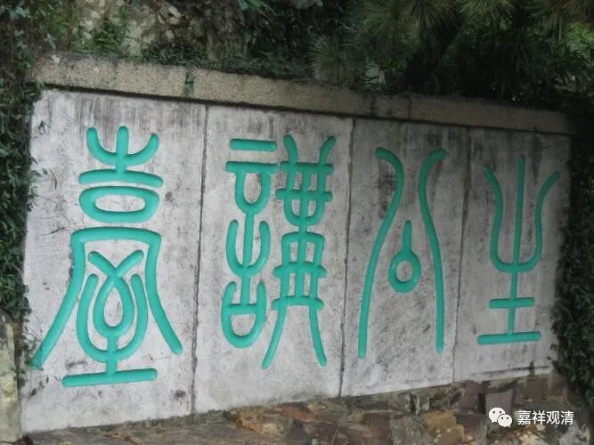

吉藏《百论疏》在解释《百论·舍罪福品》中设问：

**“问：竺道生云：‘善不受报，一向锺佛。’成实师云：‘一念之善，有于二义：一者报因，感人天之果；二者习因，相生得佛。’今云“舍福”，为同此二义，为异彼两师？”**

今释：

吉藏设问：

道生法师立论有“善不受报义”，说“善不受报，一向锺佛。”成实师（不知道是成实师中的具体哪位）说，善有两种：一、报因（善），感人天果；二、习因（善），生起的时候在成佛的时候。

现在你的立论“《舍罪福品》”的“舍福”，跟他们一样，还是另有所见？

清案：

吉藏法师对此的回答我们稍后再说。先说道生大师的“善不受报义”。

道生法师，罗什弟子，后世尊为“涅槃圣”。宋·慧琳赞为“众经云披，群疑氷释，释迦之旨，淡然可寻，珍怪之辞，皆成通论”，立了很多特别的观点。据澄观《华严疏钞》说有“生公十四科”，十四科中有“善不受报义”，其余还有“顿悟成佛”、“二谛论”、“应有缘论”、“佛无净土论”、“佛性当有论”、“法身无色论”（《法苑珠林》）等等。

魏晋南北朝时期思想界有玄学流行，讲“清谈”，清谈要立义，提一个观点，大家来问难往复。比如嵇康的《声无哀乐论》《养生论》都是流行的题目。“生公十四科”应该也是这类“辩题”。汤用彤《汉魏两晋南北朝佛教史》引陆澄《目录》：“述竺道生善不受报义，释僧璩（qú） 释（僧）镜难，璩答”，及《广弘明集》亦见南齐刘虬亦述《善不受报义》，都说明“善不受报”义非常流行。（其中释僧璩曾常驻的虎丘，此是道生的驻锡地，著名的“生公说法，顽石点头”的发生地就在虎丘。）

 

虎丘·石点头

虎丘·生公讲台

（这里，我现在手里用的民国版“璩”字和后面的“释”字空开，无“僧”字。我觉得“璩”“镜”之间的“释”字应该连在上面读，即“述竺道生善不受报义，释僧璩释”，这样比较说的通，后面“镜难，璩答”也比较合拍。到时候我再查一下新版。）

吉藏在《法华义疏》里也提到道生的《善不受报论》：

** “昔竺道生着《善不受报论》，明一毫之善并皆成佛、不受生死之报，今见《璎珞经》亦有此意。”**

连起来看，“善不受报，一向锺佛”就是“明一毫之善并皆成佛、不受生死之报”，是说“善法不令它在生死中受报，而趋向成佛”，但假如是这个意思，也并不高深啊？……

而且大乘基《成唯识论述记》批评“善不受报”似乎不是在这个层面说的。

《成唯识论述记》说：

** “此中即显古道生法师《善不受报论》非也，同小乘中‘由有漏善亦感报’故。”**

前后还是不能完全说得通，再研究……

        修改于