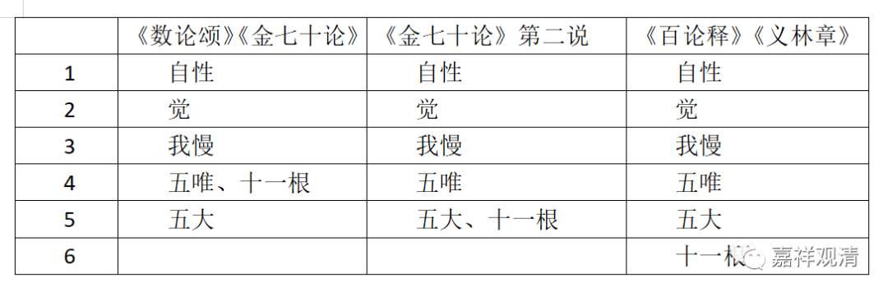

**《百论》笔记·数论二十五谛的三种生灭说**

依《数论颂》与《金七十论》，二十五谛中，“神我”不生灭，除“神我”外的其他二十四谛的生起是：

《数论颂释》：

** “……由自性（生）大，然后（生出）我慢，由此（我慢生）十六（谛）系列，在由此十六（谛中的）五（唯生）五大。”**

** **

《金七十论》：

** “自性先生‘大’。……‘大’次生‘我慢’。……‘慢’次生‘十六’。五唯……生五大……”**

《数论》和《金七十论》的“十六”，是指“五唯”+“十一根”。（我们暂时称其为数论派二十四谛生灭的“基本说”。）

世亲《百论》、大乘基《大乘法苑义林章》都说由“五大”生“十一根”，和《数论颂》、《金七十论》不同。

《金七十论》第五颂的释，又有一种二十四谛次第——

** “自性为大因；我慢，大为因；五唯，慢为因；根等十六物，五唯为其因。”**

这里。“十一根”由“五唯”生起。

但《金七十论》这一点所对应的《数论颂释》部分仍旧和“基本说”保持一致，《数论颂释》说：

** “觉依赖自性；我慢依赖觉；十一根和五唯依赖我慢；五大依赖五唯”**

这样，数论派二十四谛的生起次序，所知的就有三说——

《数论颂》《金七十论》

《金七十论》第二说

《百论》《义林章》

1

自性

自性

自性

2

觉

觉

觉

3

我慢

我慢

我慢

4

五唯、十一根

五唯

五唯

5

五大

五大、十一根

五大

6

十一根

        修改于