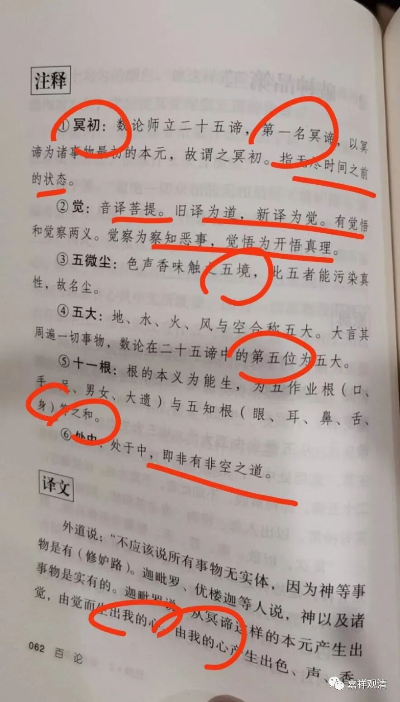

拿《白话<百论>》再凑一篇

跑完步，拿出佛盲白话的《百论》消遣消遣……随便翻一页，注解基本全错。

我都懒得打字了，直接上照片——

“冥初”，这就是数论派立的“自性”，蒙古教授解释为“无尽时间之前的状态”，望文生义！说这是“二十五谛”“第一”，其实二十五谛第一谛应是“神我”。

“觉”，就是数论派的“大”，强先生解释成“觉悟”、菩提、道。还说这个有觉悟、觉察的意思，真是联想丰富！

五唯，强哥说“五境”是不合适的，“五境”是佛教的说法，

五大，注解说是数论二十五谛的第五位。可是“五大”是“第六位”！第一神我，第二自性、第三“大”，第四我慢，第五、五唯；第六才是五大！

十一根：强教授漏了一个“心”，还把“眼、耳、鼻、舌、皮”写成“眼、耳、鼻、舌、身”——“皮”，不是“身”！这是数论和佛教用词的区别！强教授压根就没去查过数论派如何立的“二十五谛”！

必须多晒晒

又注解“处中”为“非空非有之道”。其实数论派说“神我”是“有”而非“能生所生”的。

再白话“我心”为“我的心”，这里的“我心”就是数论派说的“我慢”！

听说强教授最近又接了活儿，准备祸祸《华严经》了！求放过！高抬贵手可好！

