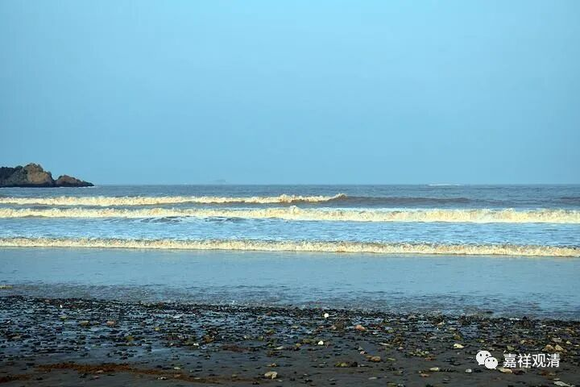

**《成实论》笔记·色蕴·四大（一）**

《成实论》的四大（地、水、火、风）和其他所有宗派的都不同，它（《成实论》的四大）不具备最基础的元素的性质，这受到很多佛教学者的质疑。其实（根本不成难），《成实》论主的定义里就没准备和其他宗派共许（主要针对说一切有部）。

其余宗派（以说一切有部为主）说的“地、水、火、风”四大，就是坚、湿、暖、动性，是物质的最小单位，具有最基本元素（极微）的性质，是触觉的对象。

《大般涅槃经》：

** “善男子！如地，坚性；火、热性；水，湿性；风，动性。”**

世友《众事分阿毗昙》：

** “云何色？谓四大及四大造色。云何四大？谓地界、水、火、风界……**

** 云何地界？谓坚。云何水界？谓湿润。云何火界？谓温暖。云何风界？谓飘动。”**

世友《品类足论》：

** “色云何？谓诸所有色，一切四大种及四大种所造色。四大种者，谓地界、水界、火界、风界。**

** ……地界云何？谓坚性。水界云何？谓湿性。火界云何？谓煖性。风界云何？谓轻等动性。”**

《舍利弗阿毗昙》：

** “何谓地大法？触入中地大，是名地大法。”**

《入阿毗达摩论》：

** “色有二种，谓大种及所造色。大种有四，谓地、水、火、风。界能持自共相或诸所造色，故名为界。此四大种，如其次第，以坚、湿、煖、动为自性，以持、摄、熟、长为业”**

《大乘广五蕴论》：

** “云何四大种？谓地界、水界、火界、风界。此复云何？谓地，坚性；水，湿性；火，煖性；风，轻性。”**

** **

这里也只是举一部分阿毗达摩的说法而已。可以看到，世友以后，这一“四大就是坚湿暖动”的说法基本已经固定。

若以《阿含》及更早期的阿毗达摩经典来看，对“四大”的论说还不是原子性的极微，仅仅做泛泛地罗列。如《阿毗达摩法蕴足论》：

** “云何地界？谓地界有二种：一、内；二、外。**

** 云何内地界？谓此身内所有各别坚性、坚类、有执、有受。此复云何？谓发毛爪齿乃至粪秽。复有所余，身内各别坚性、坚类、有执、有受，是名内地界。**

** 云何外地界？谓此身外诸外所摄，坚性、坚类、无执、无受。此复云何？谓大地山、诸石瓦砾、蜯蛤蜗牛、铜铁锡鑞、末尼真珠、瑠璃螺贝、珊瑚璧玉、金银石藏杵藏、颇胝迦、赤珠右旋、沙土草木、枝叶花果。或复有地依水轮住，复有所余，在此身外坚性、坚类、无执、无受，是名外地界。**

** 前内此外，总名地界……”**

带着对说一切有部的“反动”，《成实》论主回归了《阿含》和早期阿毗达摩的四大，采取了“模糊四大说”，仅说“** 地者，色等集会，坚多故名地。如是湿多故名水，热多故名火，轻动多故名风。**”——不是“坚”而是“坚多”！这一字之差，差别就太大了！完全取消了“四大”之“基本粒子”的性质，从有部立场上来看，这是一种“思想史上的倒退”，从经部（《成实》）的立场上来看，则是对“四大极微说”的扬弃。

……

