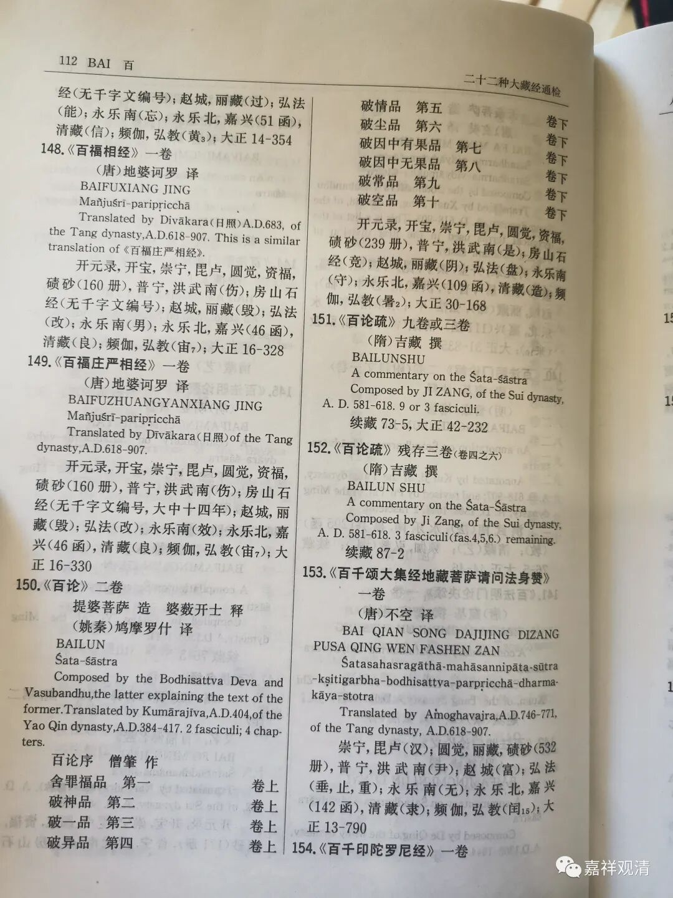

《百论》游义·002

失而复得的《百论疏》

和《中论》广受诸家重视不同，《百论》、《十二门论》很早就在印度失传了，在印度中后期的中观师（佛护、清辨、月称、寂天）和唯识师（安慧、护法、陈那）的著作里都无人提及这两部著作，所以，目前知道《百论》和《十二门论》都仅有汉译本现存。

《十二门论》可以大致理解为《中论》的略论，他和龙树诸论的重合率达到84.6%。《百论》则与《四百论》结构接近，但《百论》和《四百论》仍旧是两部完全不同的著作，并不存在如强某教授所说的“是提婆为《四百论》所作的入门书”——说出这种话的根本人不配碰佛教学术，甚至不配碰学术。当然，如果本着“我出书，我可耻，我为祖国浪费纸”的态度，出多少这种“东西”都可以。

《百论》的注解，历史上极其少见。除了吉藏大师的《百论疏》，其余在佛教传记、目录当中仅提到过一两部，即便是这一两部也远谈不上权威，所以都被历史淘汰了。从这一点来说，中国佛教史里的《十二门论》还要更幸运一些，华严宗的法藏大师有过一部《十二门论宗致义记》，一直在藏经体系当中。当然，难得除了阅藏的人会念一下以追求功德，一般也没人读它……

吉藏的《百论疏》，盛唐（含）以后便无人提及，甚至连《开元录》都没挤进去，也因此，它（《百论疏》）自此告别的汉文佛典权威体系——《大藏经》。游离于这部大丛书（《大藏经》）的结果就是，他在汉地失！传！了！

好在三论宗在唐初就传入高丽和日本，章疏携去完整，所以，吉藏的很多著作在隔壁日本保存着。近代，杨仁山在英国结识了南条文雄，相约互通有无，终于传回了三论章疏，其中重要的就有吉藏的三论《疏》，金陵刻经处据此刻印，才算“失而复得”。后来日本做《大正藏》和《卍续藏经》，也收录了吉藏的《中论疏》《百论疏》《十二门论疏》，所以你们现在搜cbeta可以搜到《百论疏》，但从盛唐至晚清，国内是没有《百论》靠谱注解的（我甚至觉得“靠谱”这两个字删掉都完全可以）。

