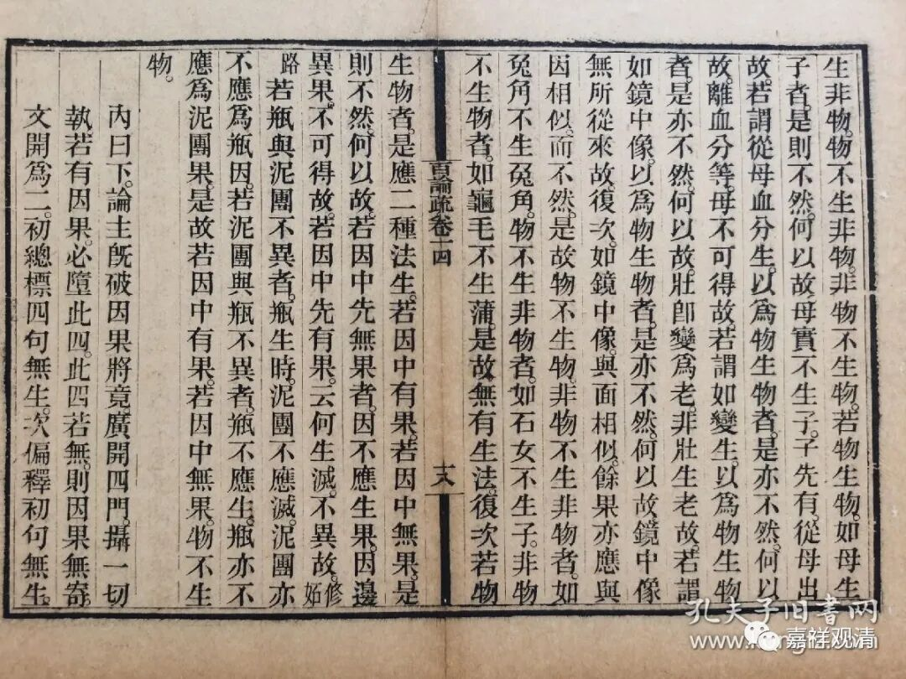
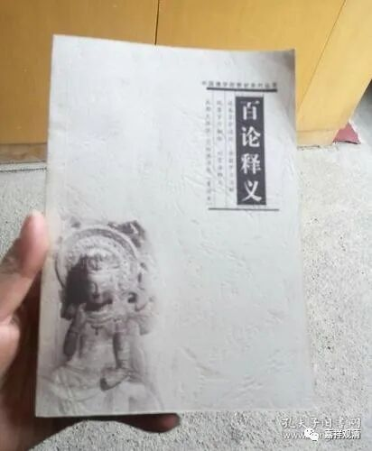

**《百论》游义·参考书**

《百论》在印度很早就失传了，在汉地也一直以来没怎么受到重视，三论宗湮灭以后，《百论》就只“活”在各个版本的《大藏经》里了。所以今天我们学习《百论》，手里可供参考的资料很少——

首先是权威注解吉藏的《百论疏》，三卷或者九卷，《大正藏》和《续藏经》里收录了。金陵刻经处有线装本的《百论疏》，是十四卷本。金陵刻经处这个本子没见过有新印的（目录里也没看到），台湾有这个本子的影印本。上海古籍出版社有一个《中论·百论·十二门论》带《疏》的合集，这个版本的三论《疏》是影印的《大正藏》，没有特别的参考价值。

刘常净先生有《<百论>释义》，这个现在有很多版本，网上也有电子版，目前是最值得参考的书了。老先生以前在中国佛学院跟着观空法师和周叔迦学的中观、三论，是站在佛教内部的观点传统地展开四平八稳的陈述……此书的质量在《百论》所有参考书中目前要排第一了。

 

《<百论>析义》，李润生著，这也是作者“中观三论析义”中的一部，作者本人应该算是唯识系统的学者。相对刘常净先生的传统，这部书就有很多新派的解读了，比如经常把《论》中的论难编成三段论的格式——这种形式在全部“中观三论析义”都有体现，是一个新的尝试，也很值得大家参考。这本书现在也有很多版本（有送的、也有花钱的），大家应该不难收集。

至于佛光山的白话《百论》，那就是纯粹的糟蹋经典，应该示众吊打。大家不用看了，除非你想骂它。

顺便提一下“佛光山白话藏”，因为很多人在后台问。这个系列作品的质量参差不齐，有些是旧有成书而收录入丛书里的，这些质量基本都比较好；有些是后来组稿白话的，就有相当部分的质量堪忧。当然后来组的局里面也有不错的，我记得《异部宗轮论》那部就挺好的。（这个白话系列如果要批评的话，编辑应该要吃板子。）

《百论》好像现在就这几个参考资料了。另外，《藏要》里面收录了《百论》，如果想要校对的话，可以用它做底本。

        修改于