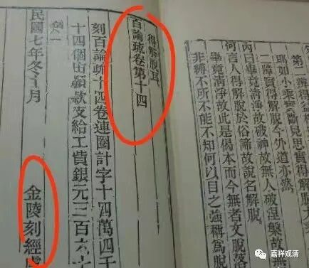

**《百论》游义·修妬路**

现存的汉文《百论》，实际已经是“《百论》本颂+婆薮开士的释”的结合本了。鸠摩罗什大师翻译的习惯，在提婆原文后都单独注有“修妬路”。Cbata里都加了括号，估计藏经原文是小字。这种翻译的时候直接夹注的形式，鸠摩罗什、义净等译师都常用。

“修妬路”，就是su^tra，玄奘大师翻译为“素怛囕”，大家平时最常用的却不是这两位大师的译例，倒是“修多罗”。“三藏”里的“经藏”用的就是修多罗su^tra，“十二部经”的第一个也是修多罗。

《百论》提婆的原文，这明显是“论”而被称为“经”——“修妬路”“修多罗”，似乎有点奇怪……其实这在现在看起来虽然不常见，不过早期却也不是什么特殊的孤例，比如一切有部瞿沙论师（即有部四大论师中的妙音论师）的《阿毗昙甘露味论》，就也有被称为《甘露味经》的。

吕澄先生在《印度教源流略讲》里对此解释说：“修多罗有二义，一指三藏中的经，一指简而又简的略诠文体……”《英汉词典》也说sudra有二义，一是（梵文的）箴言，格言，经，二是（佛教或耆那教的）修多罗，经。所以鸠摩罗什把提婆《百论颂》原文标注为“修妬路”是完全没问题的。这样一标注，也给我们阅读、研究提供了一点方便。

PS：

稍微提一下，看到一位法师关于《百论》的论文里说金陵刻经处的《百论疏》为三卷，这种错误你们（佛学院的研究生）以后写论文的时候一定要注意不能犯！金陵刻经处的《百论疏》是十四卷，不是三卷。金陵刻经处的《百论》则是两卷。那位法师应该完全没有见过金陵刻经处版本的《百论疏》，而“想当然”地把cbeta的“三卷”抄上了。（这种就是缺老师揍！）做学问要老实！

