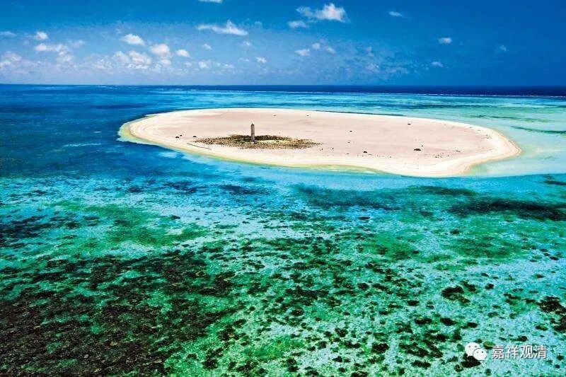

**《百论》游义·名实相符称世尊**

原文：

** “外曰：偈言‘世尊之所說’，何等是世尊？**

** 內曰：汝何故生如是疑？**

** 外曰：種種說世尊相，故生疑。有人言：韦紐天(秦言遍勝天)名世尊。又言：摩醯首羅天(秦言大自在天)名世尊。又言：迦毘羅、優樓迦、勒沙婆等仙人皆名世尊。汝何以獨言佛為世尊？是故生疑。**

** 內曰：佛知諸法實相明了無礙，又能說深淨法，是故獨稱佛為世尊。”**

今释：

“问：你的颂文里面有‘世尊之所说’，怎么才能称为‘世尊’？这里的‘世尊’指向谁呢？

答：你的问题点在哪里呢？

论敌：‘世尊’这个称号大家都在用，所以不知道你这里‘世尊’的实际指向。比如说，诸天神比如韦纽天、大自在天等都被称为世尊；数论派的创始人金发仙、胜论派的创始人鸺鹠仙、耆那教的创始人苦行仙也被称为‘世尊’……你这里单单说佛是‘世尊’，所以才有了这一问。

自宗回答：佛陀明了实相，通达事物的终极真理而无有障碍，又能演说此甚深的道理，所以惟独称佛陀为世尊。反过来说，只要明了实相无碍、演说无余，都可以称为世尊。”

义解：

之前说了，“世尊”这个词是印度各宗各派通用的“尊号”，《百论》这里提到了“二天三仙”可名“世尊”，也只是例举而已。

印度（这里指地理概念的印度）的宗教信仰派别、体系非常庞大，并不真的有统一的“印度教”这个概念（“印度教”这个说法是英国人发明的），每个相对独立的小信仰都有自己的“世尊”，你的大自在天固然是你的世尊，我的象鼻神也是无上世尊……不同的信仰派别之间各自有自己的神灵体系和排序。

所以在这里假设对方提问：佛陀为什么称世尊？称世尊的太多了！

自宗的意思：我并不是以自身之好恶而给乔达摩·悉达多上“世尊”这样的“尊号”，我们的意思是，明知一切实相无碍，并传播解说无碍无余，就是“世尊”。佛陀释迦牟尼是这样，所以我们尊为“世尊”。如果另有某神、某仙、某大师也符合这个条件，就也是我们敬礼的对象，也是世尊，也是佛陀。

