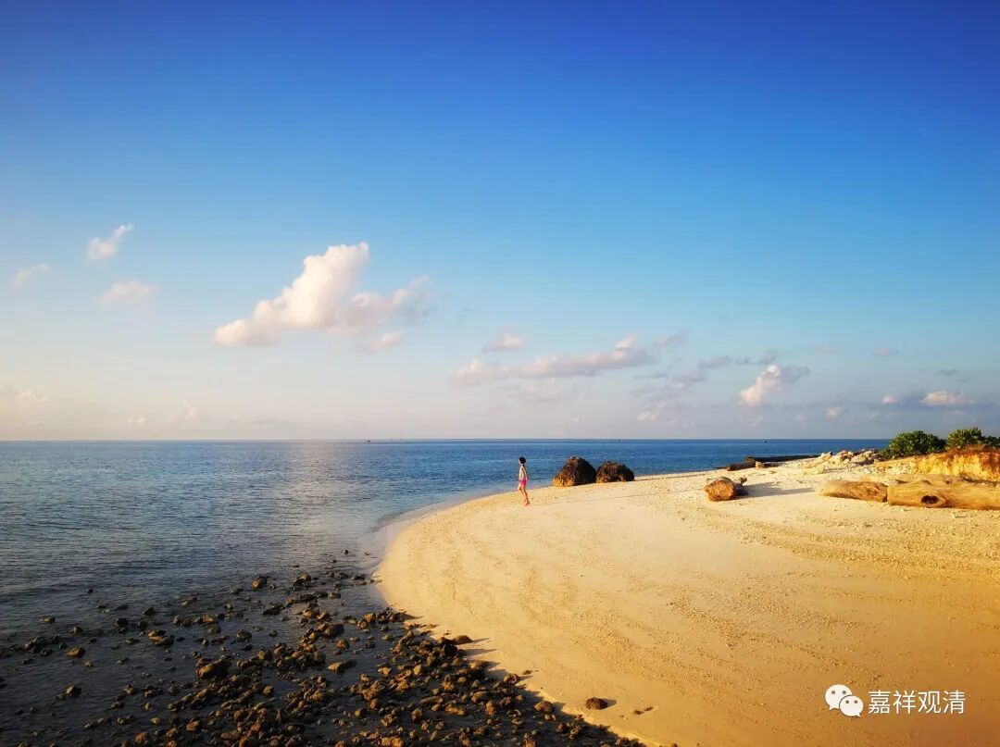

**《百论》游义·苦行、裸形，为一？为异？**

原文：

** “外曰：諸餘導師亦能明了諸法相，亦能說深淨法。**

** 如迦毘羅弟子誦《僧佉經》，說諸善法總相、別相，於二十五諦中，淨覺分是名善法。**

** 優樓迦弟子誦《衛世師經》，言於六諦，求那諦中日三洗、再供養火等，和合生神分善法。**

** 勒沙婆弟子誦尼乾子經，言五熱炙身、拔髮等受苦法，是名善法。**

** 又有諸師，行自餓法、投淵赴火、自墜高巖、寂默常立、持牛戒等，是名善法。**

** 如是等皆是深淨法，何以言獨佛能說耶？”**

今释：

对方说：那其他的导师们也能明了事物的真理，也能说甚深清净的道理。

比如（数论派）金发仙弟子学《数论》，说善法之总相、别相，他们举“二十五谛”（神我、自性、觉、我慢、五大、五唯、十一根），其中，“自性”所生的“觉”（又称为“大”）的清净的那一部分就是善法。

胜论派鸺鹠仙弟子学《胜论经》，把一切事物总结为六谛：实、德、业、同、异、和合，其“德谛”中的“每天洗三次澡”（灭罪）、“早晚两次火供”（生福）这些，与“神”和合，依此“实谛”（地、水、火、风、空、时、方、我、意）中的“神”（今译“我”）生善法部分。

耆那教苦行仙弟子学耆那教的经典，说五热炙身、拔发等自我受苦能除先造之恶业，而是善法。

另外又有一些宗派师，说绝食辟谷、跳崖、足蹈篝火、止语而立、持牛禁忌等，能得解脱，而是善法。

这些大师们都行深净之法，你怎么说只有释迦佛能说深净法呢？

义解：

《百论》释中明确宗派所属的外道是三种：数论、胜论、耆那教，但《百论疏》解释则有四种：数论、胜论、苦行派、裸形派。

《阿含》背景下，“尼揵陀若提子”即耆那教大雄尼乾子，并没有异说，但道泰译坚意《入大乘论》、菩提留支译提波《破外道四宗论》都把“尼揵陀若提子”分为“尼揵陀”、“若提子”二，以前者为“苦行仙”，后者为“裸行仙”。唐以后中国佛教都延用此“分化”说……

吉藏在《百论疏》里实际两者通用，在谈到外道六师时，称“尼揵陀若提子”，是一；在破“一异”、“破因中有无果法”时，则分为“勒沙婆”（尼揵陀）与“若提子”，则视为“二”。

这个还可以继续讨论。一般说“裸形外道”肯定是指向耆那教的（耆那教有裸形派），但“苦行”则未必，苦行在印度是很多教派都奉行的内容……

