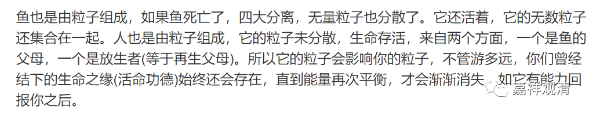
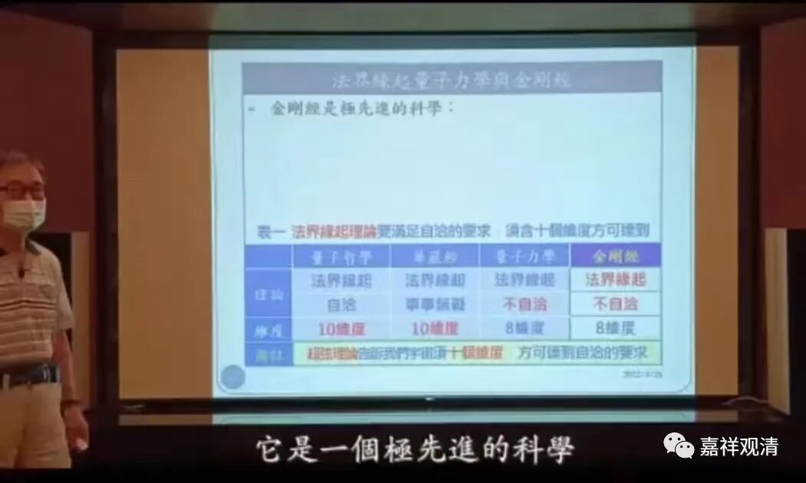

**《微课堂佛教史》304·1**

好，我们继续禅宗史。

现在讲到圭峰宗密禅师的坐禅法，这篇“坐禅法”整个风格是延续天台系统的，而且他比较认同天台的如来藏系统或者说天台在哲学方面的解释，自认为和他们的思想是一致的——以我们的今天用语来讲，就是“如来藏——本觉思想”这个系统（也有人称作“真常唯心”）。

当然，我们也不能说印度佛教里就完全没有这种思想，即使有，也基本上是不成建制的。应该说，这种思想在印度的一些宗教派别当中倒是有的，而类似的思想在印度的佛教当中，实际上是从来没有作为正统的地位出现过的，从来都不具备正统的地位。但是，“如来藏——本觉思想”在汉地和藏地却是很有市场的——在汉语系佛教和藏语系佛教当中都是很有市场的。

那么，圭峰宗密禅师的有些说法，包括接下去要谈的第五个“治病”等等，都是很中国化的一些做法。反正我讲课到现在批评的东西也比较多，这里不妨也批评一下吧。其实有些内容我已经删掉不讲了，现在讲的这些都是经过筛选的。

还有一个情况我之前也讲过，因为这些禅师毕竟是古人，他们的水平受限于他们之前的知识来源，所以在知识方面多多少少会有一点问题。圭峰宗密禅师肯定也是受到了唐朝初中期（乃至盛唐时期）佛教的** 平均**知识水平的影响，所以有问题也是正常的，不像我们今天能够获得的资讯会多一点。客观地来讲，如果我们和他是处于同一个时代，不见得能比他更聪明。但是我们现在接触的东西比他们多，所以在某些地方就能以批判的眼光来评价他们。

圭峰宗密禅师的坐禅法八门：** “一、总标；二、调和；三、近方便；四、辨魔；五、治病……”**现在我们讲到第五个“治病”。其实这个“治病”有点多余，因为他们对于治病，实际上是外行。但是大家都写，也就必须不能漏掉这一科。

讲到外行，我还想说另外一个问题，就是很多法师们，特别是今天的很多法师们，存在一个很大的问题，就是他们“不知道自己什么不知道”。这就有点像我们以前讲自己读大学的情形：一年级，不知道自己不知道；第二年级，知道自己不知道；第三年级，不知道自己知道；第四年级，知道自己知道。

很多法师都出现过这个情况——就是“不知道自己什么不知道”，这其实是非常危险的。于是，他们就在一些自己不知道的领域说话，包括佛教和非佛教的方面（比如医学、物理学等等）。当然，科学家当中也有一些很奇怪的现象，比如某几位当代的教授根本不懂佛教的，却在那儿胡扯佛教，看起来特别令人讨厌，他们都是“不知道自己不知道”。所以有了一个讲经心法：“外事不决，量子力学；内事不决，磁场感应！”

外行，特别是不知道自己是外行的人，通常都会这样。佛教当中也会出现这种情况，虽然是法师，但是缺乏世间的知识，所以就在世间的知识方面各种胡扯，这个挺麻烦的。

比如上面，两种人喜欢谈“量子佛教”，一种是没受过高中教育的sdj法师，一种是会读“佛教”这俩字便认为自己懂佛教的“科学家”（甚至还有中文系系主任），他们“熟练”运用“类比”的原始证明方法，不约而同的得出“量子佛教”的结论，简直堪比我证明：“乒乓球是圆球，太阳是圆球，神棍的脑袋也是圆球，所以是神棍的脑袋变成的乒乓球和太阳！”md智障！

