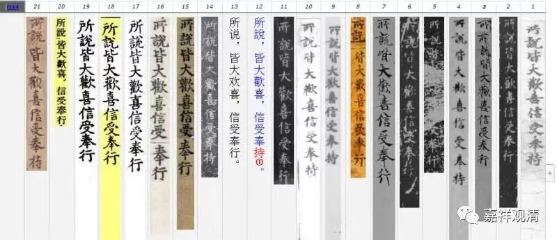

**《百论》游义·“信受修习”、“信受奉行”与“信受奉持”**

原文：

** “何等為善？身正行、口正行、意正行。身：迎送、合掌、禮敬等。口：實語、和合語、柔軟語、利益語。意：慈悲、正見等。如是種種清淨法，是名善法。**

** 何等為行？於是善法中信受修習，是名為行。”**

今释：

哪些是“善行”的“善”呢？身口意的正行——身：迎来送往、合掌、礼敬等等；口：诚实、团结、柔和、有利益的语言等；意：慈悲、正见等。这样种种的清净法，都叫“善”。

什么是“行”呢？对这些“善”能信、受、修习，就是行。

义释：

拟敌宗设问：什么是善法？回答说“恶止、善行”，意思是“先遮止非福，次行一切善”，前者为“止相”，后者为“作相”（持相）。两者都是“善”，这里“善法”的“善”概念比“善行”的“善”要宽，因为它还包含了“止恶”的部分。

这里说对善法要“信受修习”，后来我们常见的是《金刚经》里的“信受奉行”，意思差不多。其实《金刚经》的更多早期的写本和木刻板本都是“信受奉持”，“持”“行”形近，可能抄着抄着看错了……意思虽然差不多，从版本校勘角度来看，“持”胜于“行”。

下面是相关学者做的几个敦煌本及各种大藏经本的对勘，借机会大家一起学习一下……

很随喜有人来做这种基础的校勘工作，也还是需要更多的人来做这类工作呢……

