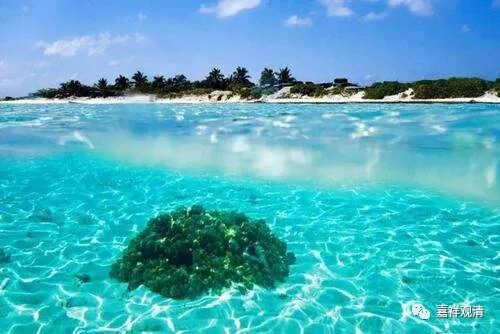

**《百论》游义·盐相盐中住**

原文：

“** 外曰：是吉，自生故，如盐(修妬路)。**

** 譬如盐，自性醎，能使余物醎。吉亦如是，自性吉，能使余物吉。**”

今释：

对方说：吉，自生，如盐。（修多罗——《百论》本颂）

比如盐，本身咸，也能让其他东西咸。“吉”（阿沤）和盐一样，自性吉，能让（放在他后面的）其他东西吉祥。

原文：

“** 内曰：前已破故。亦盐相盐中住故(修妬路)。**

** 我先破无有法自性生。**

** 复次，汝意谓“盐从因缘出，是故盐不自性醎，我不受汝语”，今当还以汝语破汝所说。盐虽他物合，物不为盐，盐相盐中住故，譬如牛相不为马相。**”

今释：

自宗回复说：前面已经破完了。另外，盐的相状是在盐上的。（修多罗——《百论》本颂）

我之前已经破完了，无有法自性生。

再者，如果你的意思是“盐是因缘生，所以盐非自性咸——但是我不认可”。那现在就还以你的话来破除你的观点。盐和其他的东西在一起，其他的东西不是盐，盐相（咸）在盐中才有，譬如牛相不是马相。

义释：

外道说：你破自、他、共生，后二者与我无关。我说吉自性生，如盐。盐自性咸，能令他物咸。所以吉自性吉，能令他物吉！

自宗分作两方面回应：

首先：前面已经“破自生”，“一切法自生”都已破除，你这个“吉”也在“一切法”里面，早就破除了，不必再谈。

第二：按你的说法（纵），“自性咸，能令余物咸”，这个不对啊！（夺！）“盐相盐中住”！咸的始终是盐，盐并不能令余物咸！（盐相，就是盐的特征，也就是这里的“咸”。）比如牛在马群里，牛始终是牛，不能令马变成牛。有角（牛相）的始终是牛，马群里的马不能有牛角（牛相）！

