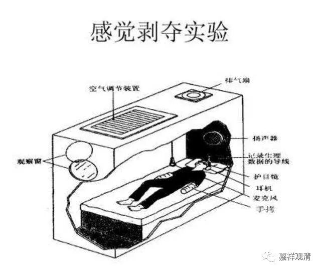

**《微课堂佛教史》309·1**

这里说到的两种定——“欲界定”和“初禅未到地定”，大家要把“欲界定”理解为散心定。

这个时候是什么情况呢？** “身心泯然空寂，”**这个“空寂”只是一种感觉，不是说你已经证到“空”了，这个只是你的感知。** “定心安稳，”**心非常地平静。** “于此定中，都不见身心相貌。”**入定之后，特别是最初入止以后，“都不见身心相貌”，这是什么意思呢？我们称之为“心一境性”。相对来说，它还不是圣根本定的那种情况，而在世间定当中，主、客观好像不是那么明显，是基于禅定或者基于止的原因不去分别。大家要注意，这个是“不去分别”，而不是“根本无分别”。我这样讲也有点累，因为很多人可能根本没有学过这些内容，暂时就先这么讲一讲吧。

这里要再提一下的，“** 于此定中，都不见身心相貌**”，不是证空，很多人问我禅修时候有这个“空的感觉”“感觉身体都不在了”，其实这个仅仅是一个感觉问题，不是禅修体验。比如现在有感知剥夺实验，把你蒙上眼睛浸在一个盐水箱里……这时候眼耳鼻舌身都近似感受不了外界，会有一种空朗朗的感觉，这种“感觉”不是禅修体验，是类似这里的“都不见身心相貌”——打坐的时候，因为对外界环境接触很少，会有一种外境、自身都体验不到存在的感觉……这其实只是打坐的一种感觉现象，甚至只是初学打坐会有的一种情况，并不神秘、伟大，也不是什么证悟的境界，甚至都不是禅修体验。

** “于后或经一坐二坐，乃至一日二日，一月二月，”**再往后，时间就可以放长。在汉传佛教里面就经常会强调打坐的时间可以比较长，但是Z传佛教中特别是Z大师等等就强调说打坐的时间其实不需要太长，时间太长的意义并不大，四个小时就够了。

当然，时间更长也会有一些好处，但同时也会有一些坏处，比如说我们刚才谈到的心源性猝死等等情况。你打坐的时候如果气脉不通的话，就会出现中风的情况。所以有些老和尚坐的时间长了会出现中风，其实就是和这个有关的，因为打坐时间长了，下肢静脉回流不畅，可能会导致血栓的形成，腿一放下来，血栓就有可能往上冲……这种情况是实际存在的。

Z传佛教就认为打坐不需要花太长的时间，因为你花太长的时间也不见得能有什么实际的效果，能够坐两到四个小时，稍微长一点就可以了，不需要坐太长的时间。

一般来说，汉传佛教都比较强调打坐的时间要长，长就说明定功比较好，是吧？我们也看到，虚云老和尚就是坐的时间长了，出定后马上就中风了。他那一次在泰国坐的时间非常长，好像是个把月，是吧？但是后来马上就中风了，这是有相关联性的。所以，未必要坐那么长的时间。

以前汉地有一位广钦老和尚，也是一坐好久，是吧？大家都以为他死了呢，准备把他火化了。后来弘一法师去敲引磬，把他给“唤醒”了。

