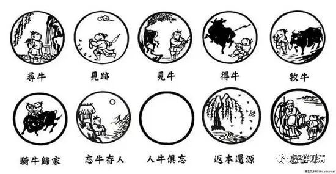
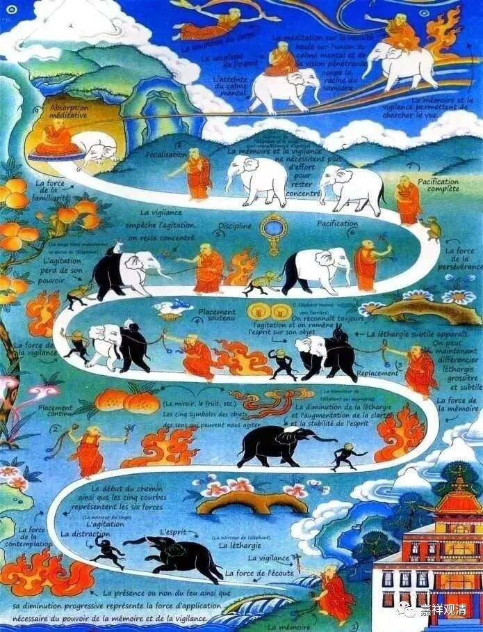

**《微课佛教史》314·2**

《十牛图》，是从什么地方开始讲的呢？

有一位禅师叫沩山大安禅师，他后期也是在沩山，和沩山灵佑禅师在一起。大安禅师是福州人，后来也到过江西，在石巩慧藏禅师身边学习。中间的部分我们就不讲了，再后来他就来到沩山灵佑禅师那里，帮助他建立僧团（此事后话，暂且不表）。他曾经见过百丈怀海禅师。

** 大安禅师问百丈曰：“学人欲求识佛，何者即是？”（**我想做佛，我应该怎么做？）

** 百丈曰：“大似骑牛觅牛。” **

** 安曰：“识后如何？”（**认出来了又怎么样呢？）

** 百丈曰：“如人骑牛至家。”（**就像骑着牛到了自己家。）

** 安曰：“未审始终如何保任？”（**那应该怎么去保任它呢？）

** 百丈曰：“如牧牛人，执杖视之，不令犯人苗稼。”**

这些都是在说什么呢？我还是这么说，都是指的禅修。这些并不是什么开悟的境界，很明显的就是禅修的境界——“不使犯人苗稼”。

所以在公案当中就说沩山大安禅师在沩山三十多年，是什么情况呢？** “安在沩山，三十年来，只看一头水牯牛，”**还是说他在那里禅修。所以“水牯牛”这个公案的原型其实是在这里。所谓的“看一头水牯牛”、“作水牯牛”等等，其实都是指的禅修，并不是说去投胎变成一头水牛。

** “若落路入草便牵出；”**如果心偏到其他地方去了，就把心抓回来。** “若犯人苗稼即鞭挞。”**如果心散乱了，跑得很远了，那就该好好地修治。** “调伏既久，可怜生受人言语……”**后面我们就不讲了。

之后好像是在宋代的时候，有一个地方叫“鼎州”，出现了《住鼎州梁山廓庵和尚十牛图颂并序》，大致的文字也是从这里面来的。这个文字是不全的，全的文字在《十牛图颂》当中。

** 第一、“寻牛”。从来不失，何用追寻……**

** 第二、“见迹”……**

** 第三、“见牛”……**

** 第四、“得牛”。**“得牛”基本上就是准备开始修止观，开始能够用得上一点功夫了。

** 第五、“牧牛”。**正在修止观了。

** 第六、“骑牛还家”。**可以运用了。

** 第七、“忘牛存人”。**如果到了“忘牛存人”的境地，应该差不多是初禅未到地定，可以这么理解。

** 第八、“人牛俱忘”。**如果让我来解释的话，这个时候是开始修出世间定。

** 第九、“返本还源”……**

** 第十、“入廛（chán）垂手”。**“廛”的意思是家里、房子，回到房子里面就不管了，事情已经做完了，就垂手。

那么，这个就是禅宗的《十牛图》，和藏传佛教的那个调伏狂象的《调象图》有得一拼。

历史的来看，“调象图”明显是印度背景的，而唐宋时期中原已经没有象，牛则普遍能见到，所以应该是先有“调象图”的原型然后再中国化为“牧牛图”。

今天先讲到这里，谢谢大家！

