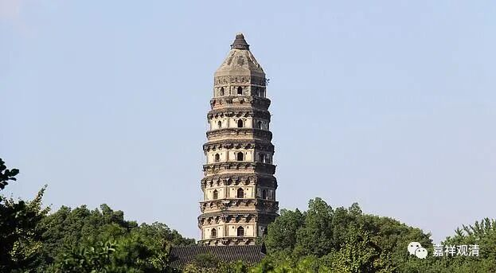

**《微课佛教史》316·2**

又到了池州，在什么地方呢？就是今天的贵池。

大家可能对贵池不太了解，但是我一说九华山，你们应该就了解了，九华山就在贵池，属于安徽池州。如果对池州再没有什么印象呢，可能还有一个事情可以帮助提醒，就是当年常遇春和陈友谅在池州打过两仗。对了，还有一个你们也可以记住，就是离我们白云寺不远。我刚去白云寺的时候，电信的这些信号还不是很好，我在那里用手机的时候，经常不小心就变成打长途了。是什么呢？就是我人在江西，但是用的是池州的信号。就是我们那里从空间上来说距离池州已经不远了，甚至可以收到池州的信号，所以有时候我给自己的寺院打电话，一不小心就变成长途电话了。

洞山良价禅师来到了池州，他拜见南泉普愿禅师——这位禅师我们前面也讲过。再后来他又到了江西，刚才我们讲贵池那里是安徽的南面，然后稍微往南一点，就已经到江西了。我们的白云寺就在江西，是吧？他在江西拜见了沩山灵祐禅师。最后又去了什么地方呢？云岩寺。

我们说过，洞山良价禅师最主要的师父是云岩昙晟禅师。那么，云岩在哪里呢？云岩，就是云岩寺，也有些地方写成灵岩寺。我在《大藏经》里面查到过，有写灵岩寺的，也有写云岩寺的，云岩寺的写法更多一点。

现在苏州有个博物馆，苏州博物馆里面的主要藏品来自两个寺院：一个是云岩禅寺的地宫，一个就是瑞光寺的塔或者说瑞光塔。现在苏州博物馆在全国也是非常有名的，是地级市当中藏品非常丰富出彩的一个博物馆。

大家还记得吗？我们在讲三论宗的时候曾经讲到过虎丘山的云岩寺，它也是三论宗或者后期的牛头宗比较重要的一个地方，核心人物经常会去那里讲经说法或者居住的一个地方。之前我们还谈到了华严宗的四祖清凉澄观法师，他是在哪里学习三论的呢？也是在虎丘山，也是在云岩寺。之前我们还提到过，就是圭峰宗密禅师把三论系的牛头、径山和石头系一起并称为中观禅，那么云岩昙晟禅师就是石头系的，因为他的师父是药山惟俨禅师。你们看他住在什么地方呢？住在苏州的虎丘山。所以这些派系互相之间都是有点关系的。

后来洞山良价禅师就到了云岩昙晟禅师这里，据说他之前在沩山灵祐禅师那里已经获得认可，但是他自己觉得并没有开悟，可能自己并不觉得算是真正的开悟，所以他还在参访，这个时候就到了云岩昙晟禅师那里，也是问了一些问题。

……

