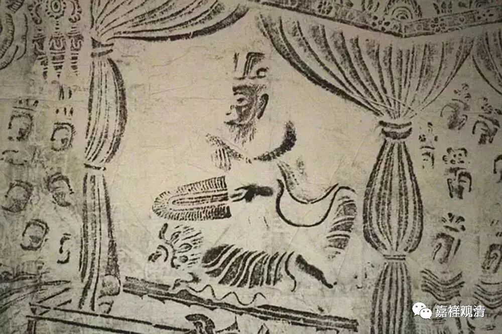
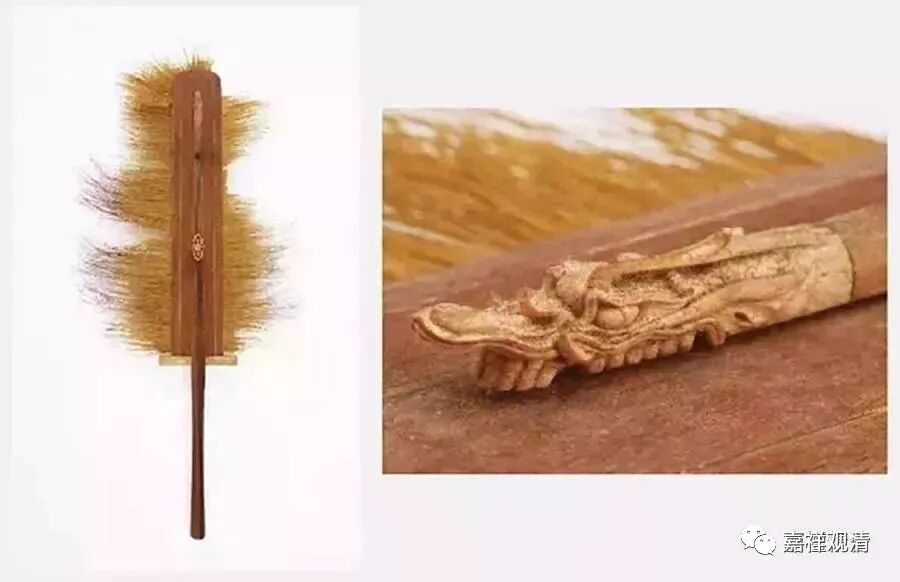
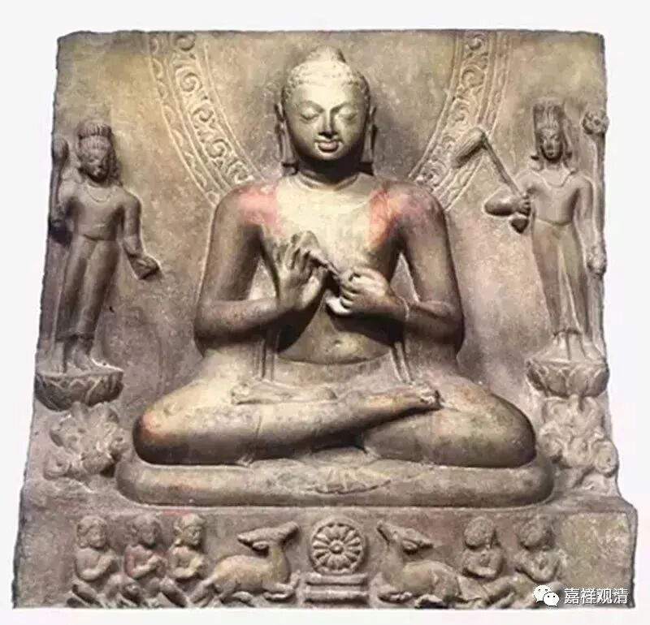
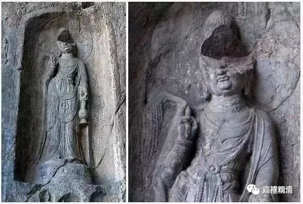

**微课堂佛教史 317

我们先补一下之前的事情吧。洞山良价禅师去到沩山灵祐禅师那里的时候，他问了什么问题呢？问的是南阳慧忠国师的“无情说法”的公案。他说：“南阳慧忠国师说的‘无情说法’的这个事情，我没搞清楚，希望师父来讲一讲。”然后，沩山灵祐禅师就很客气地回答他：“阇黎，你来问吧。”“阇黎”就是阿阇黎，以今天的话来讲，就是“大师”的意思——这是客气话。

那么，这个“无情说法”能不能成立呢？如果我们单纯地从教下来说的话，无情本身是不能说法的，是吧？“无情表法”大概是可以的。那南阳慧忠国师的这个“无情说法”到底是怎么回事呢？洞山良价禅师就去问沩山灵祐禅师。

沩山灵祐禅师就给他竖起了拂子——那个像扇子一样的东西，塵尾，有说就是拂尘。

维摩诘持塵尾

日本正仓院六朝塵尾

印度浮尘

中国浮尘

现在泰国的法师也有扇子，是吧？他们有分段位——哦，不叫段位，是分九级的阿毗达摩师，由国王发给扇子，每个级别的扇子都不一样。look——

日本人也喜欢玩扇子，是吧？Sai佐为那个扇子很帅，啥时候我也去弄一个。

我想我们以后是不是也搞一下扇子？学修的水平到了一定的程度，我就发一把扇子，建立不同的级别。

然后沩山灵祐禅师就问他会不会、懂不懂，洞山良价禅师回答说不懂。“不懂的话，你去参访云岩昙晟禅师吧。”就把他给介绍到云岩禅师那里去了。

这个中间还要讲一个问题，就是关于“无情说法”这个问题是南阳慧忠国师先谈的，是吧？在洞山良价禅师的传记当中，有一种说法是说他见过南阳慧忠国师，但我们知道实际上从时间上来说是绝对不可能的！南阳慧忠国师生卒年代为675年－775年，洞山良价禅师生卒年代为807年-869年，洞山良价禅师出生的时候，南阳慧忠国师都圆寂32年了，所以他是不可能见到南阳慧忠国师的。这个洞山良价见南阳慧忠故事的编纂主要还是为了提出关于“无情说法”的这个问题。（禅宗传记的编撰者常常无视历史的真实。）

后来洞山良价禅师就到了虎丘山，去参见了云岩昙晟禅师，还是问了同样的问题。不过说实话，沩山灵佑禅师让他就这个问题区问云岩昙晟禅师绝对是有原因的，这个待会儿我们再说。

洞山良价禅师问云岩昙晟禅师，说：“无情说法，什么人得闻？”

云岩昙晟禅师就说：“无情得闻。”

洞山良价禅师又问：“和尚闻否？”那师父你听不听得到呢？

云岩昙晟禅师说：“我若闻，汝即不闻吾说法也。”如果我听得到，那你就听不到我说法了。这里面也是有理由的，如果我听得到，那不变成我是无情了吗？但是后面半句“汝即不闻吾说法也”，我是无情的话，差不多也就有点不说法的意思。

洞山良价禅师继续问：“某甲为甚么不闻？”为什么我听不到呢？

然后云岩昙晟禅师也和沩山灵祐禅师一样，竖起了拂子，问：“还闻么”听到了吗？

“不闻。”没听到。

云岩禅师就说了：“我说法，汝尚不闻，岂况无情说法乎？”我这有情说法你都听不到，你都不了解，更何况无情说法呢？

洞山良价禅师就问：“无情说法，该何典教？”出自什么典故呢？

云岩昙晟禅师就回答他说：“岂不见《弥陀经》云‘水鸟树林，悉皆念佛念法’？”《弥陀经》里面不是这样讲的吗？

说实话这个时候洞山良价禅师应该并没有开悟，或者说也不是很清楚这个事情。

