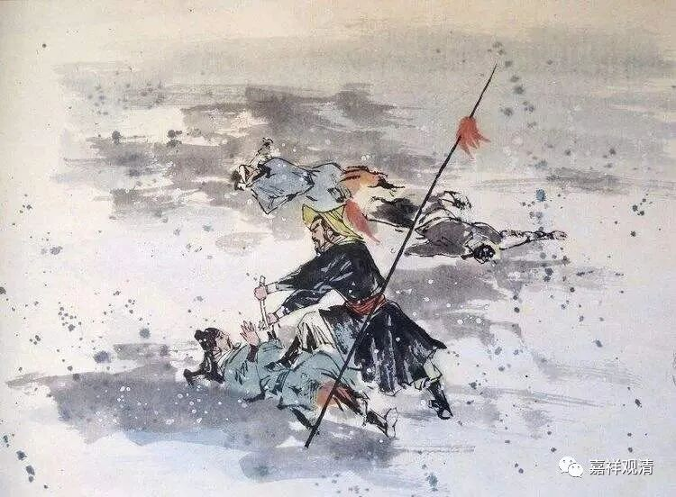
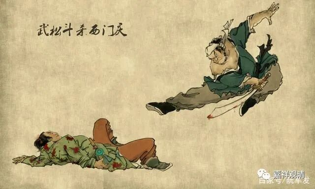
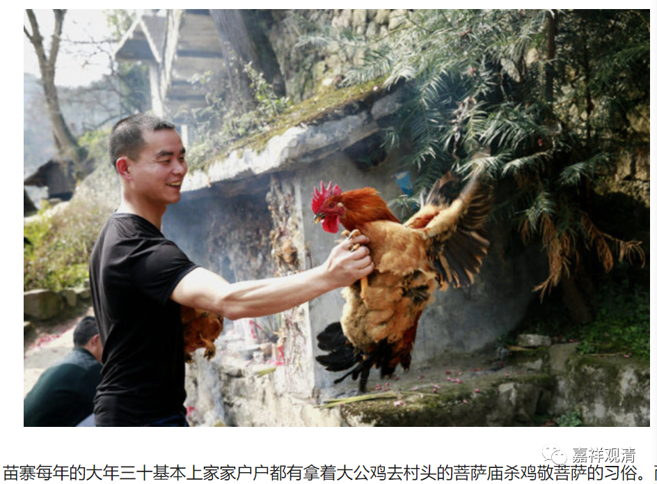
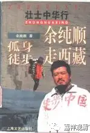

**《百论》游义·血祀的民间传统**

原文：

** “复次，有漏净福无常故尚应舍，何况杂罪福（修妬路）。**

** 如马祀业中，有杀等罪故。**

** 复次，如《僧佉经》言，祀法不净、无常、胜负相故，是以应舍。”**

今释：

再者，有漏清净的福报无常，尚应舍弃，何况夹杂着罪过的“福”呢？！（修多罗）

比如杀马祭祀的业中，有杀等罪过。

另外，如数论经中说，血祭法不净、非常、胜负相，所以应当舍弃。

义释：

印度的婆罗门教中有“祭祀万能”之说，其中有杀生祭祀——血祭的传统。血祭在印度宗教传统中也有争议，各派给予不同的解释，不认同的则把祭祀理解为“奉献瑜伽”等等。数论派属于印度婆罗门正统宗教系统，但不支持血祭，说那是“罪”，是追求表面的文字造成的。数论派说自性和神我是常，杀生祭祀不是修行解脱之法，也不会得到常乐的果报。

这里的《僧佉经》，即数论派的经典。可能是早期数论派的典籍。吉藏在此指向《金七十论》。《金七十论》确实明确提出杀马祭祀为“不净法”之一类。

血祀的传统在各种“文明”的原始宗教里都有遗存，有些作为民俗、传统、民间宗教一直有保留，常见如《水浒传》里《林冲风雪山神庙》里：

“……把陆谦上身衣服扯开，把尖刀向心窝里只一剜，七窍迸出血来。将心肝提在手里。回头看时，差拨正爬将起来要走，林冲按住喝道：‘你这厮原来也恁的歹，且吃我一刀！’又早把头割下来，挑在枪上。回来把富安、陆谦头都割下来。把尖刀插了，将三个人头发结做一处，提入庙里来，都摆在山神面前供桌上……”

又如武松：“武松按住，只一刀，割下西门庆的头来。把两颗头相结做一处，提在手里，把着那口刀，一直奔回紫石街来．叫土兵开了门，将两颗人头供养在灵前。”

至今中国过年的时候很多地方仍有杀生祭祀的行为，甚至还有杀生血祭供菩萨的。

以前余纯顺步行走西藏之前先割了盲肠，看他的日记，就有“血祭”的意思在里面。

