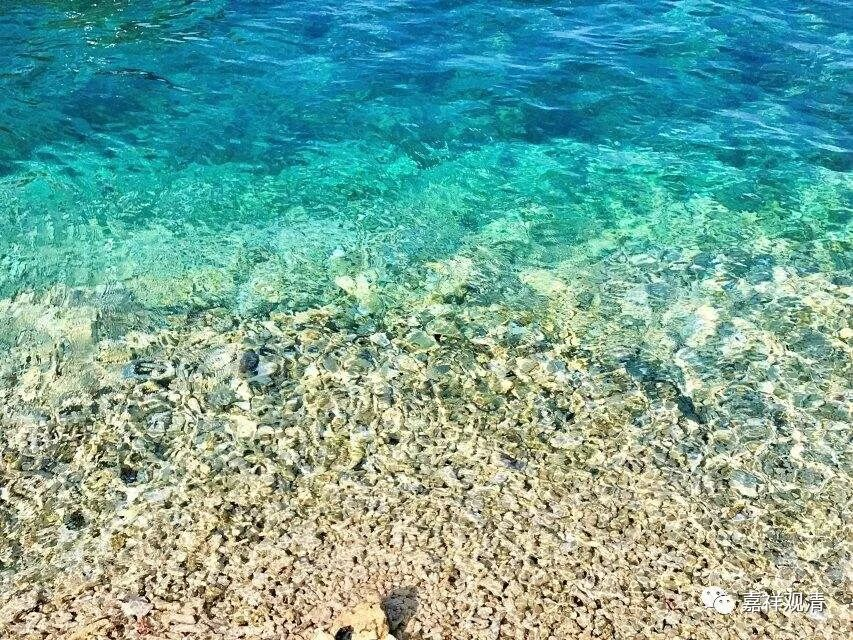

**《微课佛教史》322·2**

他来到洞山良价禅师那里，就有了那则公案。公案当中很明确地说，他叫“本寂”。（假如这个公案是后来“造”的，那我也不知道怎么算了，但这种可能性也不是完全没有。）

在禅宗的传记当中，对他到底叫什么名字，有很多不同的说法。百度里面的说法，我觉得至少是整理了一些。《祖堂集》里面说他的名字就叫“本寂”；元代的《释氏稽古略》也说他的名字叫“本寂”；《禅林僧宝传》说他的名字叫“耽章”；《舆地纪胜》也说他叫“耽章”……

那么，“本寂”是不是他的本名？如果从刚才我们说的他参见洞山禅师的公案来说，好像他的本名应该叫“本寂”。《通志》——也就是地方志，说他叫“本寂”，这个大概不可以采用，因为后期地方志的水平其实不咋地，可以直接悬置。公案当中就说他参见洞山良价禅师的时候洞山禅师问“阇黎名甚么”，就是问他：“大师啊，您叫什么？”曹山本寂禅师就说“我叫本寂”。

为什么叫“曹山”呢？因为后来他把自己住的那座山的名字给改了，他自己是“曹溪的一滴水”，就把这座山改名“曹山”了。历史上有很多这样的情况，把当地的地名给改了。实际上他改的曹山，本来的意思有点像“曹溪山”的意思。

现在也有类似的情况，比如说台湾有一些宗派，这些和尚是在民国后期我们这里解放了以后去到台湾的，比如说他原来在这里的寺院叫“莲花山白云寺”，去到台湾以后他就重新建立了一个寺院，还是叫“莲花山白云寺”，等于把当地的名字给改了。日本也有这种情况，中国的和尚过去，他本来的寺院是叫“黄檗寺”或“黄檗山XX寺”的，他到了日本京都，就把当地的“大本山”也叫“黄檗山”。所以，有些地名是被人改掉的，“曹山”就是这样的，而且“曹山”的全名实际全称应该是“曹溪山”，是吧？

下面我们来讲一下这则公案。

** 洞山问：“阇黎名甚么？”**你叫什么名字？

** 师曰：“本寂。”**本寂禅师说我叫本寂。

** 山曰：“向上更道？”**还有什么说的呢？

** 师曰：“不道。”**曹山本寂禅师说不说了。

** 山曰：“为什么不道？”**

** 师曰：“不名本寂。”**这也倒是，你向上再说，那就不叫本寂了。

不过，这里面还可以有另外的解释。“不名本寂”也可以理解为《金刚经》里面的那个，“是本寂，即非本寂，是名本寂”，是吧？他现在是“不名本寂”。

良价禅师就很器重他，** “许入室”**，同意他来个别扣问。** “寂处众如愚，发言若讷”**，不说话。** “盘桓数载”**，待了很多年。** “辞洞山”**，辞别洞山禅师。

** 复问曰：“子向甚么处去？”** 到什么地方去呢？

** 师曰：“不变异处去。”**

** 山曰：“不变异处，岂有去耶？”**洞山禅师就说：“不变异处，到哪个去处呀？”

** 师曰：“去亦不变异。”遂辞。**就走了。

其实我也不知道啥叫“不变异处”，大概就是随着脚走吧——放浪江湖，呵呵，到处走。

后来曹山本寂禅师就在江西抚州，把“吉水山”改名叫“曹山”，也就是“曹溪山”。曹山本寂禅师的弟子非常多，弟子多的原因我们刚才已经讲了，就是因为有“南平王”钟传的护法。

好，今天有点事情，所以讲得晚了。先到这里，谢谢大家！

